***现在不知道老师在说什么，先看一看这部分***

把Cha 4看到了字符型驱动，dhgg给我发了一份重点，于是开始按照重点复习
<details>
<summary>
  历史，版本，许可证（Gemini）
</summary>
1. Linux 的核心概念（简答题标准得分点）如果题目问“什么是 Linux / 简述 Linux 的基本概念”，答出以下 3 点即可拿满分：本质： Linux 是一个开源、免费、类 Unix（Unix-like）的操作系统内核。一切皆文件（内核灵魂）： 操作系统中的所有物理硬件（磁盘、串口、网卡等）和软件资源，在 Linux 底层都被抽象和组织为“文件”，通过统一的 VFS（虚拟文件系统）进行管理。多用户与多任务： 系统支持多个用户同时登录、互相隔离，并且支持多个任务（进程）在 CPU 上并发执行。2. Linux 的发展历史与关键节点前身： 源于 1960 年代的 Unix 操作系统。精神导师（GNU 计划）： 1983 年 Richard Stallman 发起 GNU 计划，目标是开发一套完全自由的类 Unix 操作系统。虽然写出了很多顶级的开源工具（如 GCC、Bash），但唯独缺了一个好用的核心（内核）。诞生（1991年）： 芬兰赫尔辛基大学的大学生 Linus Torvalds（林纳斯·托瓦兹）为了在自己的电脑上运行类 Unix 系统，独立开发了 Linux 内核，并于 1991 年 10 月 5 日在网络上正式公开发布。合体（GNU/Linux）： GNU 的丰富工具 + Linus 的开源内核 = 一个真正完整、可运行的商业级操作系统。3. 五大主流 Linux 发行版（考试最常考的 4-5 个）发行版的公式：Linux 内核 + GNU 组件/各种应用软件 + 包管理器 = 发行版。考试时写出以下 5 个最具代表性的：发行版名称阵营/血统特点（两句话背诵）Ubuntu（乌班图）Debian 阵营界面友好、开箱即用，是目前最流行的桌面版和云计算服务器系统之一。Red Hat Enterprise Linux (RHEL)红帽阵营著名的商业企业级服务器系统，追求极端的稳定与安全，服务收费。Fedora红帽阵营的先锋RHEL 的技术试验田，更新速度极快，总是率先搭载最新的内核技术。Debian独立纯正血统坚持纯粹的自由软件精神，以恐怖的稳定性和庞大的软件仓库闻名。Arch Linux独立血统采用滚动更新机制。只给用户一个最基础的黑框，由用户完全从零定制，深受极客喜爱。4. 开源许可证：GPL 核心总结（看一眼就能记住）Linux 遵循的核心许可证是 GNU GPL（通用公共许可证，通常是 GPLv2）。你可以把它的规则总结为三条：三大自由： 任何人都可以免费获取源码、自由修改源码、自由再次分发（传播）。强传染性（Copyleft 精神）： 这是最重要的考点。只要你的代码里用到了、或者修改了遵循 GPL 的开源代码，那么你衍生出来的整个新程序，也必须无条件地向社会完全开源！禁止闭源： 你不能把 GPL 的代码拿去修改后，直接包装成自己的闭源商业软件卖钱。在答驱动开发、或者符号导出（如 EXPORT_SYMBOL）相关的题时，通常都要在代码最后写上一句 MODULE_LICENSE("Dual BSD/GPL");，这就是在向内核大管家主动声明：“我这个驱动是合规的、遵守 GPL 协议的，请放心让我加载。”  
</details>
<details>
<summary>
    文件系统
</summary>

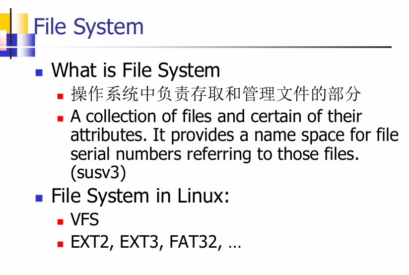
1. 第二句：A collection of files and certain of their attributes... (susv3)这一句是国际大Unix标准（SUSv3）里的硬核学术定义，考试如果出名词解释，把这个英文背下来或者翻译出来就是满分：学术翻译：文件系统是文件及其特定属性的集合。它为指向这些文件的“文件序列号（在 Linux 里叫 inode 号）”提供了一个命名空间（Name Space）。拆解“命名空间（Name Space）”：计算机只认数字，对它来说，你的毕业论文其实叫 inode 编号: 142857。但人类只认汉字和英文。文件系统提供的“命名空间”，就是强行在人类认识的路径（比如 /home/user/毕业论文.docx）和计算机认的数字（inode 142857）之间画上一条等号线。3. 第三句：File System in Linux (VFS / EXT2 / EXT3 / FAT32)这是 Linux 最引以为傲的三层金字塔架构。① 什么是 VFS（Virtual File System，虚拟文件系统）？大白话：它是 Linux 内核里的一个“超级翻译官”/“中央接口”。为什么需要它？：世界上的具体文件系统太多了（Windows 用的 NTFS、U盘用的 FAT32、Linux 自己的 EXT4）。每种文件系统的底层代码和数据结构完全不一样！如果没有 VFS：应用层写程序的人会疯掉。他想写个文件，得先判断：“如果是 U盘，我要调用 write_fat32()；如果是 Linux 硬盘，我要调用 write_ext4()”。有了 VFS 的神仙体验：VFS 在最上层统一了江湖。它对应用层说：“你们不管读写什么硬件、什么格式，一律只管调用标准的 sys_read() 和 sys_write()。底层的脏活累活和格式转换，我 VFS 在后台帮你自动搞定！”。这就是为什么前面你在学字符设备驱动时，所有的 read/write 接口长得一模一样，就是因为它们都接在 VFS 这根标准大线上。② 后面的 EXT2, EXT3, FAT32... 又是啥？它们是 VFS 手底下的“各个具体国家的翻译官”（具体文件系统），真正负责去和硬件磁盘打交道：EXT2 / EXT3 / EXT4：Linux 的亲儿子。Linux 系统安装的那个主硬盘，默认就是这种格式。其中 EXT3/EXT4 带有“日志（Journaling）”功能，哪怕突然断电，文件也不容易损坏。FAT32：Windows 家的老技术。兼容性极好，不管是 Windows、Mac、Linux 还是手机、相机，都能读写它。所以我们买到的 U盘、SD卡 默认全都是 FAT32 或者是 ExFAT 格式。📌 考前终极一句话闭环应用层发出 write() 指令 $\rightarrow$ VFS 收到指令，自动识别出你正在往 U盘写数据 $\rightarrow$ VFS 把指令转发给 FAT32 驱动模块 $\rightarrow$ FAT32 模块按照自己的格子规则，把二进制数据写进 U盘的物理扇区里。
</details>

<details>
<summary>
boot文件夹下结构
</summary>

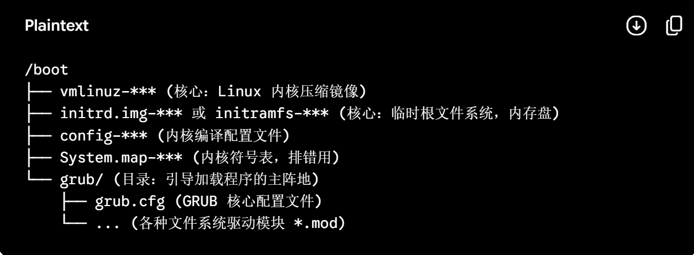
① vmlinuz- *** —— Linux 内核文件（真正的大管家）
本质：这是一个可引导的、压缩的 Linux 内核镜像文件。

名字由来：vm 代表 Virtual Memory（虚拟内存），linu 代表 Linux，结尾的 z 代表它被 gzip 压缩过。

启动时的作用：GRUB 在启动时把它从硬盘搬到内存里，它负责解压自己，然后初始化所有的硬件和软件环境。没有它，Linux 根本就不存在。

② initrd.img-*** 或 initramfs-*** —— 临时根文件系统（先遣队）
本质：initrd 是 Initial Ram Disk（初始化内存盘） 的缩写。它本质上是一个被压缩的、小型的根文件系统镜像。

为什么需要它（大考点）：

内核镜像 vmlinuz 为了控制体积，并没有把世界上所有的硬件驱动（比如极其复杂的 NVMe 固态硬盘驱动、特定的 RAID 卡驱动、甚至是 EXT4 文件系统驱动）都编译进核心。

先有鸡还是先有蛋的问题：内核需要去硬盘里读真正的系统数据，但内核此时还没加载硬盘的驱动，怎么读？

解决方案：GRUB 会顺手把 initrd.img 这个“小备盘”也加载到内存里，虚拟成一个内存盘。这个盘里刚好装了最基础的硬盘驱动和文件系统模块。内核先在内存里运行这个“先遣队”，利用里面的驱动挂载真正的物理硬盘，然后再卸载掉 initrd。

③ config-*** —— 内核编译配置文件（基因图谱）
本质：这是一个纯文本文件。它记录了当前这个版本的 Linux 内核在编译时，到底开启了哪些功能，哪些驱动被编译进了核心（=y），哪些驱动被编译成了模块（=m）。

作用：平时运行系统用不到它，但如果你想自己裁剪内核、或者查当前内核支不支持某项新技术时，看这个文件最准。

④ System.map-*** —— 内核符号常数表（活地图）
本质：纯文本文件，里面存了内核代码里所有函数名、变量名对应的内存绝对物理地址。

作用：内核在运行中如果崩溃了（Kernel Panic），打印出来的全是一堆十六进制的内存地址。程序员可以通过查看 System.map，把这些冷冰冰的地址反向翻译成人类能看懂的函数名（比如 sys_open），从而进行排错。

2. grub/ 子目录（司机的驾驶舱）
这个目录里放着 Boot Loader（引导加载程序）的核心配置。

grub.cfg（最核心）：这是 GRUB 的主配置文件（以前老系统叫 menu.lst 或 grub.conf）。你在电脑开机时看到的那个让你选择进入哪个系统、哪个内核版本的倒计时菜单，就是通过解析这个文件渲染出来的。

注意：在现代 Linux（如 Ubuntu/CentOS）中，这个文件是自动生成的，绝对不要手动去改它。如果你想修改启动项，应该去改 /etc/default/grub，然后执行 update-grub。

*.mod 文件：GRUB 也是个微型系统，它也需要读写不同的硬盘分区（如 EXT4、XFS、NTFS）。这些 .mod 文件就是 GRUB 自己的“文件系统驱动”，确保它能在大内核启动前，顺利读到硬盘里的数据。

📌 考前一句话总结
开机时，GRUB 跑到 /boot/grub/grub.cfg 里看了一眼菜单，然后熟练地把 /boot/vmlinuz-***（大管家）和 /boot/initrd.img-***（先遣队）两样东西打包塞进内存，Linux 的生命正式宣告开始。
</details>


<details>
<summary>
命令
</summary>

* 安装
  * 传统Tarball
  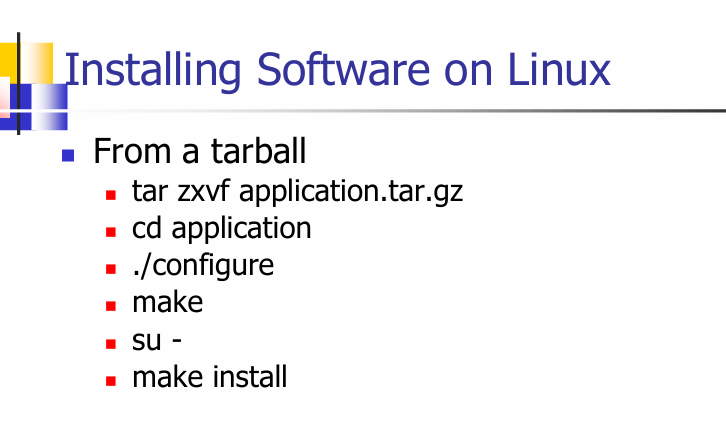
  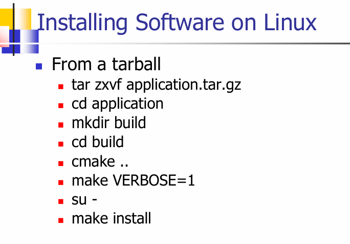
  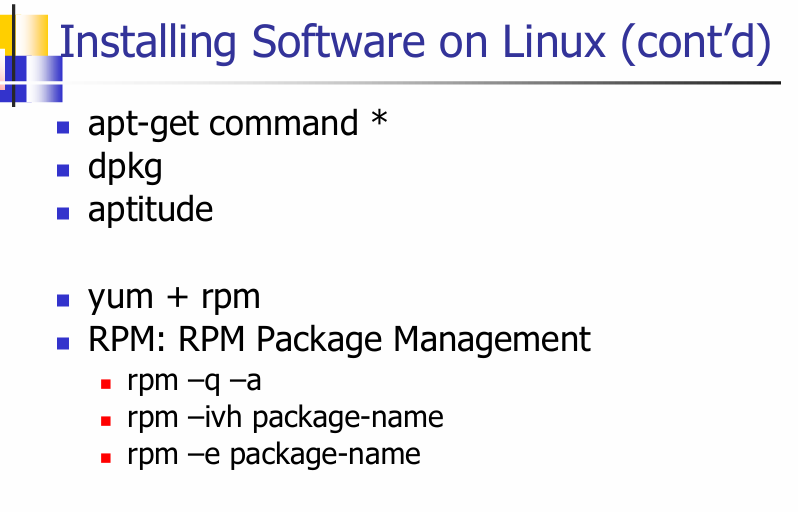

* 账户
  * ```passwd```改密码
* 时间空间
  * ```date```
  * ```cal```:calendar
  * ```clear```清屏
* 多用户系统特色
  * ```who```查看当前用户
  * ```echo```回显
  * 。。。
* ```pwd``` 打印绝对路径
* ```cd```
* ```mkdir```
* ```rmdir```
* ```ls```
* ```touch```:有则更新，没有的话创建
* ```cp```copy
* ```mv```move(如果源路径和目标路径在同一文件夹下面，则是rename)
* ```ln```link
    解释：创建文件链接。
    硬链接（默认）：两个名字指向同一个底层数据（同一个 inode 号），删掉其中一个，另一个完全不受影响。

    软链接（-s）：符号链接，真正类似于 Windows 的快捷方式，里面只存了目标文件的路径名。
    例子：这个实验路径太深了，你通过 cd ~ 回到了家目录，然后敲下：
    ln -s /home/luxu/os_experiment/lab1/main.c ./my_code.c

    意思：你在家目录下建了一个叫 my_code.c 的软链接（快捷方式）。以后你只要在家目录下对 my_code.c 进行读写，实际上操作的全是深山老林里的那个 main.c。
    1. 底层原理大比拼（本质区别）
    Linux 文件系统为了管理文件，把文件拆成了两部分：文件名（给人类看的）和 inode 索引节点（给计算机看的账本，里面记录了文件大小、权限和数据在硬盘上的物理位置）。

    硬链接（Hard Link）：

    本质：同一个文件的不同别名。

    底层动作：创建硬链接时，系统并没有开辟新的磁盘空间去存别的内容，而是在目录表格里新建了一个文件名，让这个名字的指针死死指向和源文件完全相同的 inode 号码。

    软链接（Symbolic Link / 软连接）：

    本质：一个独立的新文件（快捷方式）。

    底层动作：创建软链接时，系统会真正新建一个 inode 并分配一块小空间。这个新文件的内容非常纯粹，只里面存了一串纯文本，内容是源文件的路径名。

  1. 核心行为差异（考题陷阱集中地）
    ① 当源文件被无情删除时：
    硬链接：依然坚挺，正常读写！ 因为只要还有一个名字（硬链接）牵着那个 inode，底层的物理数据就不会被系统抹除（链接计数减 1 但不为 0）。

    软链接：立刻报废，变成“死链接”！ 因为源文件没了，软链接里存的那个“路径”就失效了，在终端里看它会变成红字闪烁报错。

    ② 跨分区/跨文件系统：
    硬链接：绝不可能！ 因为每个硬盘分区都有自己独立的一套 inode 编号，跨了分区 inode 号就对不上或者冲突了。

    软链接：完美支持！ 因为它只记路径名，它不仅能跨分区，甚至能链接到网络挂载的文件系统上。

    ③ 对目录（文件夹）创建链接：
    硬链接：绝对禁止！ 为了防止文件系统内部出现可怕的死循环环路，Linux 严禁普通用户创建目录的硬链接。

    软链接：完美支持！ 我们平时经常给深山老林里的某个配置文件夹建一个软链接到家目录下，方便快速访问。
* ```rm``
  * -i 交互，一个一个问你删不删
  * -f 强制删除
  * -r 删除所有
* ```cat``` 查看文件，将文件内容打在屏幕上
  


### 文件类型

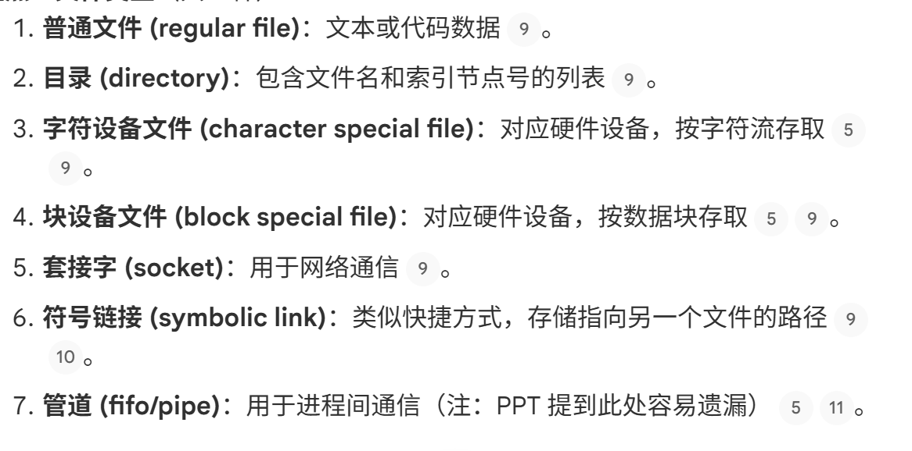

### 文件夹结构

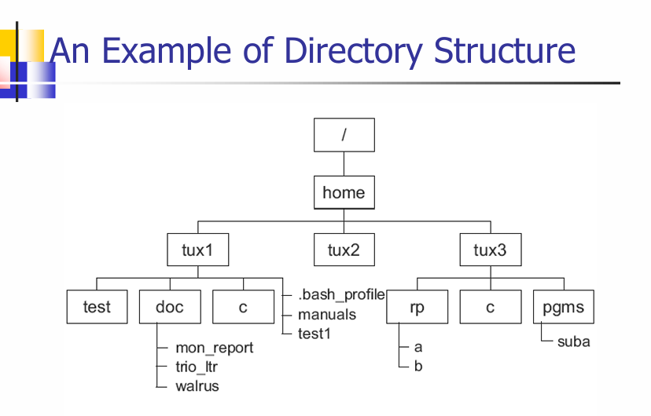
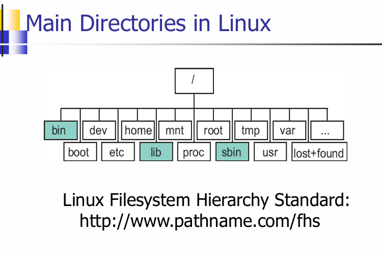

### 权限
* USER（u）
* GROUP（g）
* OTHERS（o）

基础权限
* read r
* write w（取决于该目录有木有权限）
* execute x

更改权限
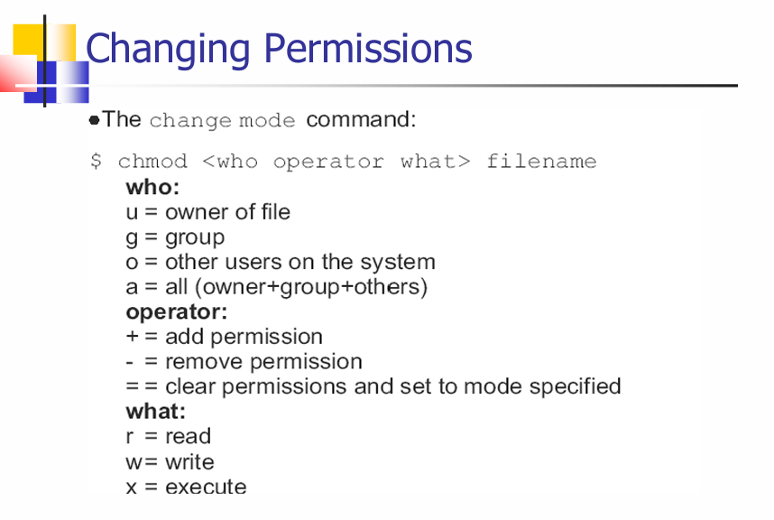
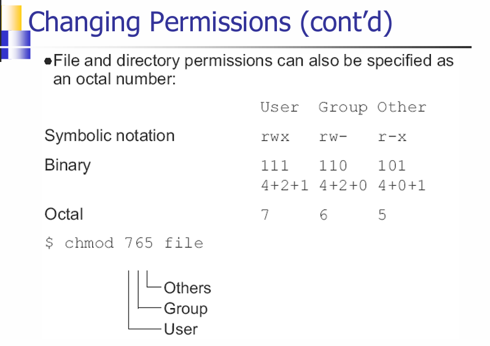
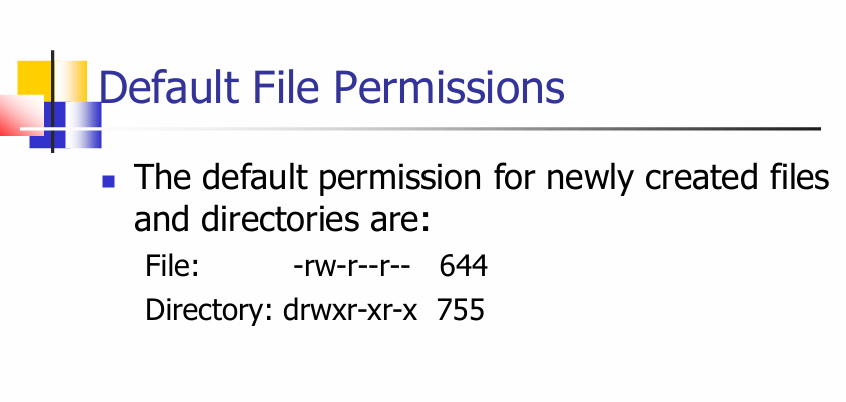

## Ch2 shell

### 区分">",">>"
  覆盖写入（>）：```echo "hello" > test.txt```

效果：如果 ```test.txt``` 不存在，直接创建它，并写入 ```"hello"```。如果它本来就存在且里面有万行代码，这行命令会无情抹干原有内容，只留下 ```"hello"```。

追加写入（>>）：```echo "world" >> test.txt```

### 管道

```ls -l | wc -l ```

```ls -l```：哗啦啦列出当前目录下所有文件的详细列表（一行代表一个文件）。

```|```：别把结果吐在屏幕上，把这堆文本喂给下一关。

```wc -l```：```wc``` 是 ```Word Count```（字数统计），```-l``` 代表统计一共有多少行。

实例二：Show subdirectories and only subdirectories?（怎么只显示子目录/文件夹？）

```ls -l | grep "^d"```

### 用户环境
```.bash_profile``` 登陆时读取，包含的命令被执行
```.bashrc``` 启动一个新的
```.bash_logout``` 退出时读取执行 

```Alias``` 取别名 ```alias/unalias ll='ls -la```


```Read```,引号，环境变量
参数和内部变量，```test```(直接用```[]```),字符串比较，算数比较，文件相关的条件测试，逻辑，```if-case```(需要倒着写表示解结尾),```for```（```do```and```done```）,```while```（```do```and```done```）,```until```（```do```and```done```）,```select```（```do```and```done```），

```shell
#!/bin/bash

# ==========================================
# 1. 变量、引号与 read 命令的用法
# ==========================================
echo "=== [1] 变量与引号交互 ==="

# 用 -p 打印提示，用 -t 5 限制 5 秒内输入，用 -s 隐藏输入（密码模式）
if read -t 5 -s -p "请输入你的安全密钥(5秒内输入): " token; then
    echo -e "\n【成功】密钥已接收。" 
else
    echo -e "\n【超时】未检测到输入，使用默认密钥。"
    token="default_token"
fi

# 演示双引号、单引号与转义符的核心区别
echo "双引号（$ 依然有效）: \"你的密钥是: $token\""
echo '单引号（$ 彻底失效）: '"'你的密钥是: $token'"
echo "转义符（封印了 $ ）: \$token 的字面意思是 \$token"

echo -e "\n----------------------------------------"

# ==========================================
# 2. 参数和内部变量（位置参数）
# ==========================================
echo "=== [2] 脚本传参（位置参数） ==="
echo "当前执行的脚本名字 (\$0) 是: $0"
echo "你一共传入了 (\$#) 个参数。"
echo "第一个参数 (\$1) 是: ${1:-'(未传参)'}"
echo "第二个参数 (\$2) 是: ${2:-'(未传参)'}"
echo "所有参数作为一个整体 (\$*) 是: $*"
echo "所有参数作为独立列表 (\$@) 是: $@"

echo -e "\n----------------------------------------"

# ==========================================
# 3. test 命令 (直接用 [ ]) 与各种条件测试
# ==========================================
echo "=== [3] test 条件测试 [ ] ==="

# (1) 字符串比较
str1="nju"
str2="software"
str3=""
if [ "$str1" != "$str2" ]; then
    echo "【字符串】'$str1' 和 '$str2' 确实不相等。"
fi
if [ -z "$str3" ]; then
    echo "【字符串】变量 str3 是个空字符串 (-z)。"
fi

# (2) 算术比较
score=95
if [ "$score" -ge 90 ]; then
    echo "【算术】分数 $score 大于或等于 (-ge) 90 分。"
fi

# (3) 文件相关的条件测试
log_file="./test_run.log"
if [ ! -f "$log_file" ]; then
    # -f 判断文件是否存在，! 代表逻辑“非”
    echo "【文件】未发现日志文件，正在自动创建..."
    touch "$log_file"
fi

# (4) 逻辑运算结合（-a 代表 AND，-o 代表 OR）
# 需求：判断分数是否在 0 到 100 之间
if [ "$score" -ge 0 -a "$score" -le 100 ]; then
    echo "【逻辑】分数 $score 在合法区间内 (0 <= score <= 100)。"
fi

echo -e "\n----------------------------------------"

# ==========================================
# 4. if-case 分支结构（需要倒着写结尾）
# ==========================================
echo "=== [4] if-case 分支语句 ==="

role="student"

# if 以 fi 结尾
if [ "$role" = "student" ]; then
    echo "身份确认：学生。正在进入课程选择系统..."
fi

# case 以 esac 结尾，条件用 )，分支用 ;;
course_code="CS"
case "$course_code" in
    "CS"|"cs")
        echo "你选择了：计算机与软件课程。";;
    "MATH")
        echo "你选择了：高等数学课程。";;
    *)
        echo "未知课程。";;
esac

echo -e "\n----------------------------------------"

# ==========================================
# 5. 五大循环结构（do ... done）
# ==========================================
echo "=== [5] 各种循环结构演示 ==="

# (1) for 循环：遍历明确的清单
echo -n "【for 循环】正在加载模块: "
for module in "基础" "控制流" "循环"
do
    echo -n "$module... "
done
echo ""

# (2) while 循环：条件为【真】时循环
count=1
echo -n "【while 循环】只要计数值小于等于3就继续: "
while [ $count -le 3 ]
do
    echo -n "$count "
    count=$((count + 1))  # 整数自增运算
done
echo ""

# (3) until 循环：条件为【假】时循环，直到变为真就停止
count=1
echo -n "【until 循环】直到计数值大于3才停止: "
until [ $count -gt 3 ]
do
    echo -n "$count "
    count=$((count + 1))
done
echo ""

# (4) select 循环 与 read -n1 结合：制作交互菜单
echo -e "\n【select 菜单】请选择你想清除的实验日志编号（输入数字）："
PS3="你的选择是（输入 3 退出）: " # PS3 是专门给 select 菜单定制的提示符环境变量
select choice in "清除旧日志" "保留并退出" "直接退出"
do
    case $choice in
        "清除旧日志")
            echo "正在清理 $log_file ...";;
        "保留并退出"|"直接退出")
            echo "正在退出菜单..."
            break;; # 跳出 select 循环
        *)
            echo "输入无效，请重新选择。";;
    esac
done

echo -e "\n====== 脚本完美结束，退出码 (\$?) 归零 ======"
exit 0
```
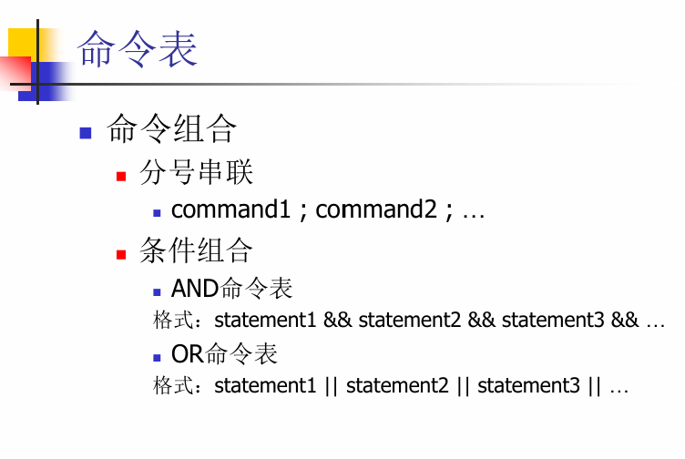
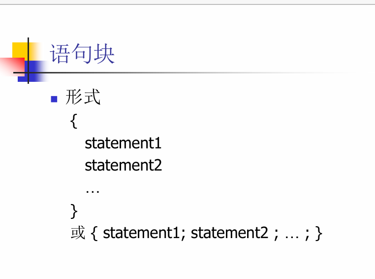
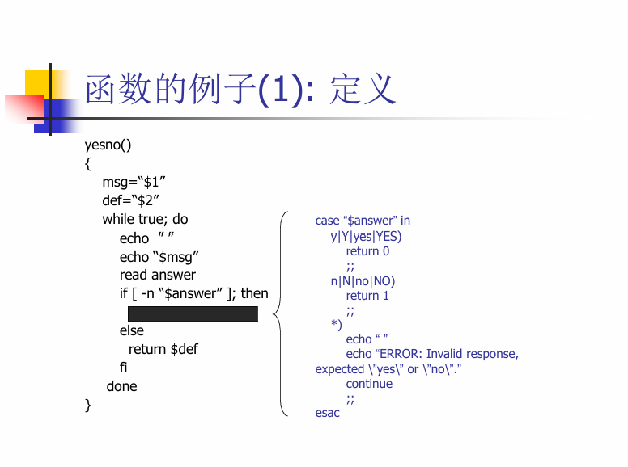

### 捕获命令输出
```shell
#!/bin/bash
# $PWD 是系统自带的环境变量，直接存着当前路径
echo "The current directory is $PWD"

# $(pwd) 是运行了 pwd 这个命令，并把它的输出结果塞到这句话里
echo "The current directory is $(pwd)"
exit 0

```

### 算术扩展
```shell
#!/bin/bash
x=0

# 当 x 不等于 10 时，循环继续
while [ "$x" -ne 10 ]; do
    echo $x
    # 核心：将 x 的值加 1。必须用 $(( )) 才能做数学加法
    x=$(($x+1))
done
exit 0
```
### 参数扩展
```shell
#!/bin/bash
i=1
while [ "$i" -ne 10 ]; do
    # 如果写 "$i_tmp"，系统会找变量 $i_tmp（结果为空）
    # 写成 "${i}_tmp"，系统就能准确识别变量是 $i，从而创建出 1_tmp, 2_tmp...
    touch "${i}_tmp"
    i=$(($i+1))
done
exit 0
```

### trap


```shell
#!/bin/bash
# 只要用户按下 Ctrl+C (产生 2 号信号 SIGINT)，就立刻执行 echo 并退出
trap "echo ' 哎呀，你按了 Ctrl+C！正在清理现场...'; exit 1" 2

echo "脚本正在疯狂运行，请按下 Ctrl+C 试试..."
while true; do
    sleep 1 # 模拟死循环
done
```
### .
```shell
#!/bin/bash
# 使用点命令引入外部文件（注意点和文件名之间有空格！）
. ./config.sh

# 此时当前脚本直接继承了 config.sh 里的变量
echo "欢迎你: $USER_NAME"
```

### 即时文档和重定向
#### ```<< !标记!```
```shell
#!/bin/bash

# cat 是读取内容的命令
# >> file.txt 是追加重定向，意思是“把内容加到 file.txt 的末尾”
# << !CATINPUT! 意思是“输入的数据来自下面的即时文档”
cat >> file.txt << !CATINPUT!
Hello, this is a here document.
这里是第二行，你可以写任意多的内容...
!CATINPUT!
# 👆 这一行单独出现，即时文档结束

exit 0
```
#### ```< ,<<,>,>>```的区别
“>” —— 覆盖输出

如果文件里原本有字，全部擦除，彻底覆盖！
```shell
echo "Hello Lu" > name。txt
```
“<” —— 追加输出

前面命令的结果接在后面文件的末尾，原本的内容完好保留，往后排队。
```shell
echo "Hello Nj" >> name.txt
```
“<” —— 输入重定向

假设我们有一个文件 words.txt，里面写了 3 行字。我们用 wc -l（数行数的命令）来读它：
```shell
wc -l < words.txt
```

“<<” ——即时文档

## Ch3
### Ch3.0
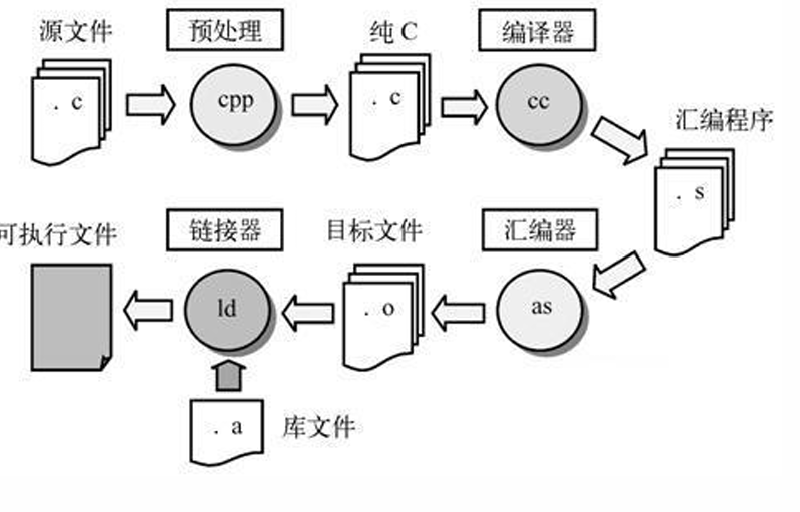
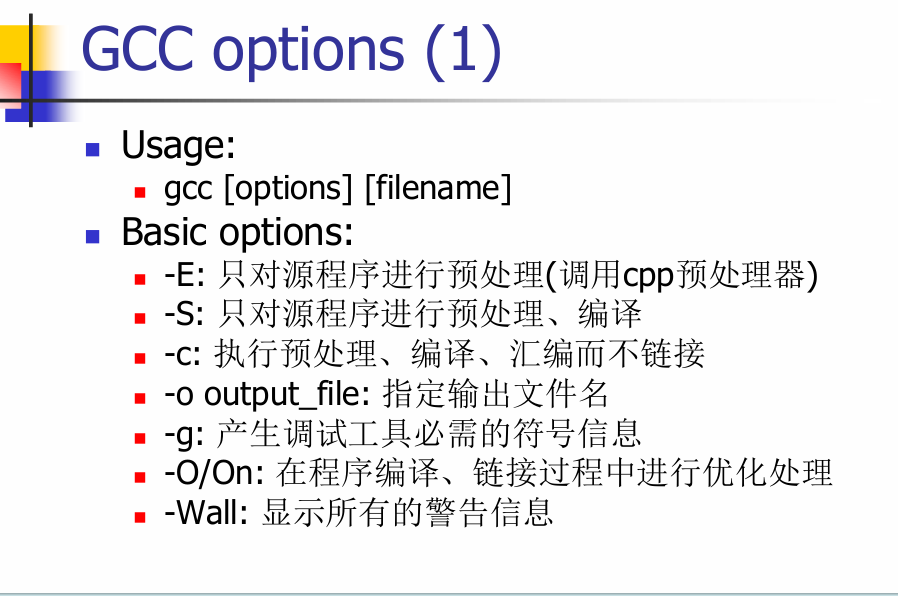
```shell
#!/bin/bash

# =====================================================================
# GCC 编译器核心命令与选项速查表
# =====================================================================

# ---------------------------------------------------------------------
# 一、 GCC 编译四大步骤（分步拆解命令）
# ---------------------------------------------------------------------

# 1. 预处理 (Preprocessing)
# 作用：展开宏定义、复制头文件、删除注释。生成预处理后的 C 代码文件 (.i)
# -E: 指示编译器只进行预处理
# -o: 指定输出文件名
gcc -E main.c -o main.i

# 2. 编译 (Compilation)
# 作用：把 C 代码翻译成计算机底层更喜欢的“汇编语言”文件 (.s)
# -S: 指示编译器只进行到编译阶段
gcc -S main.i -o main.s

# 3. 汇编 (Assembly)
# 作用：把汇编指令翻译成机器认识的二进制“目标代码”文件 (.o)，此时仍不可执行
# -c: 指示编译器执行预处理、编译、汇编，但不进行链接
gcc -c main.s -o main.o

# 4. 链接 (Linking)
# 作用：把多个二进制目标文件与系统库文件融合成最终的“可执行文件”
gcc main.o -o my_program


# ---------------------------------------------------------------------
# 二、 常用进阶控制选项（根据实验/项目需求按需添加）
# ---------------------------------------------------------------------

# 1. 包含额外的头文件搜索路径：-Idir
# 作用：如果头文件不在当前目录下（如在 ./include），需要指定路径，否则会报找不到头文件的错误
gcc -c main.c -I./include

# 2. 链接指定的函数库：-lname
# 作用：Linux 中很多特定库（如数学库 m）是独立的，必须显式指明链接。注意 -l 紧跟库名
gcc main.o -o my_program -lm

# 3. 包含额外的库文件搜索路径：-Ldir
# 作用：如果使用了第三方的非标准库，除了 -l 还要用 -L 指定库文件所在的目录
gcc main.o -o my_program -L./libs -lcustom_helper

# 4. 开启所有警告信息：-Wall
# 作用：Warning All，让编译器进行更严格的审查，显示所有潜在的警告（如定义了变量未消费）
gcc -Wall main.c -o my_program

# 5. 注入外部宏定义：-DMACRO
# 作用：不修改源代码的情况下，在编译命令里直接定义一个宏（常用于开启 DEBUG 调试模式）
gcc -DDEBUG=1 main.c -o my_program

# 6. 生成调试信息：-g
# 作用：向可执行文件中注入代码行号和变量名，是使用 GDB 调试器进行断点调试的【必加】参数
gcc -g main.c -o my_program

# 7. 编译器优化：-O / -On
# 作用：启用代码调优。-O1, -O2(常用工业标准), -O3(最高级)，能让程序跑得更快或体积更小
gcc -O2 main.c -o my_program


# ---------------------------------------------------------------------
# 三、 工业级日常开发“一键编译”万能命令（日常最推荐用法）
# ---------------------------------------------------------------------

# 作用：一口气完成预处理、编译、汇编、链接，并集齐了“看警告、加调试、搜头文件、连数学库、自定义程序名”的所有高频配置
gcc -Wall -g -DDEBUG=1 main.c -I./include -lm -o my_program

# 运行最终生成的可执行文件：
# ./my_program
```

>9点32了，没时间了，按重点问了一下ai

#### Makefile

```Makefile
# =====================================================================
# Makefile 核心语法与自动化编译万能模板
# =====================================================================

# ---------------------------------------------------------------------
# 1. 基础变量定义
# ---------------------------------------------------------------------
# 显式指定编译器（一般Rules.mak中会提供，这里单独列出）
CC = gcc
# 编译选项：开启所有警告(-Wall)，加入调试信息(-g)
CFLAGS = -Wall -g
# 链接选项：显式引入 Linux 数学库 (-lm)
LIBS = -lm

# 目标可执行程序名称
TARGET = edit

# ---------------------------------------------------------------------
# 2. 内置函数与文件筛选（让项目管理更自动化）
# ---------------------------------------------------------------------
# 用法：$(subst from,to,text) 字符串替换函数
# 示例：把 "main_output" 里的 "_output" 删掉，结果为 "main"
TEST_SUBST = $(subst _output,,main_output)

# 假设工程里有一大堆源文件，我们用变量将它们管理起来
# OBJECTS 变量记录了项目最终生成所需的所有目标中间件（.o 文件）
OBJECTS = main.o kbd.o command.o display.o insert.o search.o files.o utils.o


# ---------------------------------------------------------------------
# 3. 核心编译规则结构 (Target : Prerequisites)
# ---------------------------------------------------------------------

# 【规则一：默认总目标】
# Make 默认执行文件中的第一个目标。这里让 all 依赖于我们最终的终极程序 $(TARGET)
all: $(TARGET)

# 【规则二：终极程序链接】
# $^ ：代表所有依赖文件列表（即所有 .o 目标文件）
# $@ ：代表当前的规则目标文件名（即 $(TARGET)，也即 edit）
$(TARGET) : $(OBJECTS)
	# ⚠️ 注意：下面这行编译命令的前面必须是一个【Tab 键】，绝对不能用空格！
	$(CC) $(CFLAGS) -o $@ $^ $(LIBS)


# ---------------------------------------------------------------------
# 4. 多目标模式扩展（静态模式通配符 %）
# ---------------------------------------------------------------------

# 【规则三：批量 .o 生成规则】
# 语法： 目标集合 : 目标模式 : 依赖模式
# 作用：一行代码代替底下写十几次 main.o: main.c，实现全自动大批量编译
# $< ：代表第一个依赖文件名（这里会自动匹配对应的 .c 文件）
# $@ ：代表对应的目标文件名（这里会自动匹配对应的 .o 文件）
$(OBJECTS): %.o: %.c
	$(CC) -c $(CFLAGS) $< -o $@


# ---------------------------------------------------------------------
# 5. 具体的头文件依赖声明（时序判断的核心）
# ---------------------------------------------------------------------
# 虽然上面的模式匹配帮我们自动把 .c 编译成了 .o，但如果头文件（.h）改动了，
# 我们必须显式告诉 Make 哪些中间件依赖这些头文件，Make 才会聪明地重新编译它们。

main.o : main.c defs.h 
kbd.o : kbd.c defs.h command.h 
command.o : command.c defs.h command.h 
display.o : display.c defs.h buffer.h 
insert.o : insert.c defs.h buffer.h 
search.o : search.c defs.h buffer.h 
files.o : files.c defs.h buffer.h command.h 
utils.o : utils.c defs.h 


# ---------------------------------------------------------------------
# 6. 伪目标标签 (.PHONY)
# ---------------------------------------------------------------------

# 显式宣告 clean 为伪目标。
# 作用：防止当前目录下如果刚好有一个叫 "clean" 的真实文件时，导致 make clean 命令失效。
.PHONY: clean

# 清理项目的临时文件和可执行程序
clean :
	# 在命令前加一个减号 “-”，代表即便某些文件本来就不存在导致 rm 报错，也强制 Make 继续往下走
	-rm -f $(TARGET) $(OBJECTS)
```

###  Ch3.1
#### VFS
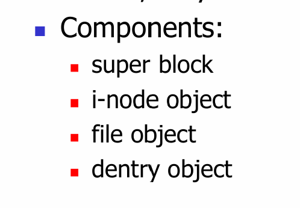
超级块 (super block)：管全盘，存整个文件系统的全局元数据。

索引点 (inode)：管实体，存单个文件的物理元数据（不含文件名）。

目录项 (dentry object)：管名字，连起“路径文件名”与“物理 inode”。

文件线 (file object)：管动态，记录进程当前打开文件的读写状态和偏移。

#### 硬链接和软链接

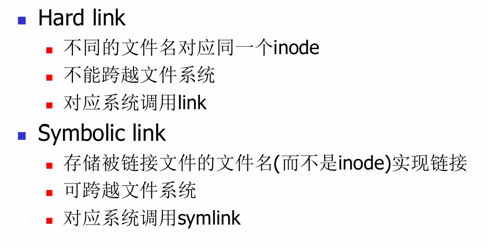

#### 系统调用的函数和参数
```c
#include <stdio.h>
#include <stdlib.h>
#include <string.h>
#include <fcntl.h>      // 提供 open(), O_RDWR 等常量
#include <unistd.h>     // 提供 read(), write(), lseek(), close()
#include <sys/stat.h>   // 提供 stat(), fstat(), S_ISDIR 宏
#include <dirent.h>     // 提供 opendir(), readdir(), struct dirent

int main() {
    // =====================================================================
    // 1. 文件的打开、关闭与创建 (open, close, mode权限)
    // =====================================================================
    const char *path = "demo_system_call.txt";
    
    /* * open(路径, 标志标志, [权限模式])
     * 核心 flags: 
     * - O_RDONLY(只读), O_WRONLY(只写), O_RDWR(读写) -> 这三个互斥且必选其一
     * - O_CREAT: 文件不存在则创建，【此时必须指定第三个参数 mode】
     * - O_TRUNC: 如果文件已存在，直接清空其内容（截断为0字节）
     * - O_APPEND: 追加模式，写入时光标自动移到文件末尾
     * 返回值: 成功返回非负整数(文件描述符fd)，从3开始分配(0:stdin, 1:stdout, 2:stderr)；失败返回 -1
     */
    int fd = open(path, O_RDWR | O_CREAT | O_TRUNC, 0644); 
    if (fd == -1) {
        perror("【Open 失败】");
        exit(EXIT_FAILURE);
    }


    // =====================================================================
    // 2. 文件的核心读写操作 (write, read)
    // =====================================================================
    const char *w_buf = "Nanjing University Software Institute\n";
    size_t w_len = strlen(w_buf);
    
    /*
     * write(fd, 内存缓冲区指针, 写入字节数)
     * 返回值: 成功返回实际写入的字节数；失败返回 -1
     */
    ssize_t bytes_written = write(fd, w_buf, w_len);
    if (bytes_written == -1) {
        perror("【Write 失败】");
        close(fd);
        exit(EXIT_FAILURE);
    }


    // =====================================================================
    // 3. 文件读写指针定位 (lseek)
    // =====================================================================
    /*
     * lseek(fd, 偏移量offset, 基准位置whence)
     * 核心 whence 参数 (必考):
     * - SEEK_SET: 距离文件开头 offset 字节处
     * - SEEK_CUR: 距离当前光标位置 offset 字节处
     * - SEEK_END: 距离文件末尾大小 offset 字节处
     * 考点提示: 刚写完文件时，光标在文件末尾，直接 read 会读到 EOF (0)。必须倒回开头！
     * 特殊妙用: off_t size = lseek(fd, 0, SEEK_END); 可直接测出文件大小
     */
    off_t curr_pos = lseek(fd, 0, SEEK_SET); // 将光标重置回文件最开头
    if (curr_pos == -1) {
        perror("【Lseek 失败】");
        close(fd);
        exit(EXIT_FAILURE);
    }


    // 再次读取
    char r_buf[100];
    /*
     * read(fd, 接收缓冲区指针, 期望读取的最大字节数)
     * 返回值 (高频考点):
     * - > 0 : 实际读取到的字节数
     * - == 0: 【核心】代表读到了文件末尾 (EOF - End of File)
     * - == -1: 读取发生错误
     */
    ssize_t bytes_read = read(fd, r_buf, sizeof(r_buf) - 1);
    if (bytes_read > 0) {
        r_buf[bytes_read] = '\0'; // 补上 C 语言字符串结束符
        printf("[Read 成功] 读取到内容: %s", r_buf);
    }


    // =====================================================================
    // 4. 获取文件属性元数据 (stat, fstat, lstat)
    // =====================================================================
    struct stat file_info;
    
    /*
     * 三大获取状态函数区别 (高频考点):
     * - stat(const char *path, struct stat *buf) : 通过路径找文件
     * - fstat(int fd, struct stat *buf)         : 通过已打开的句柄 fd 找文件
     * - lstat(const char *path, struct stat *buf): 如果是软链接，不追踪原文件，直接返回链接本身
     */
    if (fstat(fd, &file_info) == 0) {
        printf("\n--- [fstat 元数据提取] ---\n");
        printf("文件大小 (st_size): %ld 字节\n", file_info.st_size);
        printf("硬链接数 (st_nlink): %ld\n", file_info.st_nlink);
        printf("Inode 号 (st_ino): %ld\n", file_info.st_ino);
        
        // 使用 S_ISDIR 或 S_ISREG 宏判断文件类型
        if (S_ISREG(file_info.st_mode)) {
            printf("文件类型: 普通文件 (Regular File)\n");
        }
    }

    // 记得关闭打开的文件描述符
    close(fd);


    // =====================================================================
    // 5. 目录的流式扫描遍历 (opendir, readdir, closedir)
    // =====================================================================
    printf("\n--- [opendir/readdir 目录扫描] ---\n");
    
    /*
     * opendir(目录路径) -> 成功返回 DIR* 目录流指针；失败返回 NULL
     * readdir(DIR* dp) -> 每调用一次返回目录下的一个子项指针 (struct dirent*)，遍历完返回 NULL
     */
    DIR *dp = opendir("."); // 打开当前目录
    if (dp == NULL) {
        perror("【Opendir 失败】");
        exit(EXIT_FAILURE);
    }

    struct dirent *dir_entry;
    // 经典循环遍历框架
    while ((dir_entry = readdir(dp)) != NULL) {
        /* * struct dirent 核心考点属性:
         * - dir_entry->d_name : 当前项的文件名字符串
         * - dir_entry->d_ino  : 当前项对应的 Inode 号
         */
        printf("|- 发现文件: %-25s  (Inode: %ld)\n", dir_entry->d_name, dir_entry->d_ino);
    }
    
    // 关闭目录流
    closedir(dp);


    // 清理现场：删除生成的临时文件
    unlink(path);
    return 0;
}
```
### Ch3.2
重点是multicore，exec和fork

```cpp
#include <stdio.h>
#include <stdlib.h>
#include <unistd.h>     // 提供 fork(), execvp(), _exit()
#include <sys/wait.h>   // 提供 wait()
#include <pthread.h>    // 提供多核并行线程测试（编译时需加 -lpthread）

/*
======================================================================================
                     【一、 内核图解：Multicore 环境下的程序生命周期】

 [C程序启动与终止流程图]
 +-----------------------------------------------------------------------+
 | 1. 外部加载: exec 调用 ──> 加载 crt0.o (C起动例程)                     |
 |                               │                                       |
 |                               ▼                                       |
 | 2. 业务执行:               main 函数 <───> 用户自定义函数              |
 |                               │                                       |
 |                ┌--------------┴--------------┐                        |
 |                ▼                             ▼                        |
 | 3. 正常终止: 调用 exit()                  调用 _exit()                |
 |                │                             │                        |
 |                ▼ (冲洗I/O缓存、执行atexit)   │ (极粗暴断气)           |
 |            标准 I/O 清除                     │                        |
 |                │                             │                        |
 |                └--------------┬--------------┘                        |
 |                               ▼                                       |
 | 4. 彻底交权:               内核系统调用                               |
 +-----------------------------------------------------------------------+

 核心内核级考点：
 1. 启动阶段：execvp 并不直接跳到 main。Linux 会先加载 crt0.o（C 运行时启动例程），
    设置好栈帧、把命令行参数 argv 和环境变量传给 main，然后才隐式调用 main 函数。
 2. 终止阶段（exit 与 _exit 的致命区别）：
    - exit()：C 语言标准库函数。死掉之前非常温柔，会先调用终止处理程序（Atexit 注册函数）、
      冲洗（Flush）并关闭所有标准 I/O 流（如 printf 缓冲区），最后才把状态码交回内核。
    - _exit()：底层系统调用。极其粗暴，一旦调用立刻向内核交出控制权，绝不冲洗 I/O 缓冲区。
 3. 多核调度：Linux 采用 1:1 线程模型，每个线程都是独立的 task_struct。多核（Multicore）
    操作系统的 CFS（完全公平调度器）会自动将就绪的 task_struct 分发到不同的物理 CPU 核心
    （Cores）上，实现真正的硬件级并行（Parallelism）。
======================================================================================
*/

// 模拟一个高负载的计算任务，用来在多核 (Multicore) CPU 上并行运行
void* heavy_computation(void* arg) {
    long core_id = (long)arg;
    printf("[Multicore 并行] 线程 %ld 已启动，正在由 CFS 调度器分发到某个 CPU 核心上...\n", core_id);
    
    long long count = 0;
    for (long long i = 0; i < 500000000LL; i++) {
        count += i; // 纯 CPU 密集型计算，用于压榨多核性能，此时 CPU 占用率可达 200%
    }
    
    printf("[Multicore 并行] 核心/线程 %ld 计算完成。\n", core_id);
    return NULL;
}

int main() {
    printf("=====================================================================\n");
    printf(" 核心考点：Multicore, fork() 和 exec 族函数的联合协同实战\n");
    printf("=====================================================================\n");

    /*
    ======================================================================================
                         【二、 内核图解：fork() 机制（深拷贝与分身）】

     [fork 瞬间的进程空间分裂图]
     父进程 (PID: 1000)                   子进程 (PID: 1001)
     +------------------+                 +------------------+
     |   代码段 (fork)  |                 |   代码段 (fork)  | 
     +------------------+                 +------------------+
     |   数据段/堆栈     |  === 复制 ===>  |   数据段/堆栈     | (物理共享，写时复制 COW)
     +------------------+                 +------------------+
     |   返回 PID=1001  |                 |   返回 PID=0     |
     +------------------+                 +------------------+

     核心底层考点：
     1. 一次调用，两次返回：父进程中返回【子进程的 PID】(>0)，子进程中返回【0】。失败返回负数。
     2. 写时复制（Copy-On-Write, COW）：fork 的瞬间内核并不会真的在物理内存里复制一份大块数据，
        而是让父子进程共享同一块物理内存，并把权限设为“只读”。只有当某一方试图修改变量时，
        内核才会触发缺页异常，在物理内存上真正复制该页。
     3. 文件描述符的继承：子进程无条件继承父进程打开的所有文件描述符，共享同一个文件表项
        （即共享同一个读写偏移量 f_pos）。
    ======================================================================================
    */
    printf("\n[准备分身] 父进程 (PID: %d) 即将调用 fork()...\n", getpid());
    
    pid_t pid = fork();

    if (pid < 0) {
        perror("fork 失败");
        exit(EXIT_FAILURE);
    } 
    else if (pid == 0) {
        // =====================================================================
        // 子进程分支 (fork 返回值为 0)
        // =====================================================================
        printf("[子进程分支] 我是子进程，我的 PID 是: %d，我从父进程那里继承了基因。\n", getpid());
        printf("[子进程分支] 1秒后，我将调用 exec 彻底洗脑自己，变成一个全新的程序！\n");
        sleep(1);

        /*
        ======================================================================================
                         【三、 内核图解：exec 族机制（彻底夺舍与洗脑）】

         [exec 引起的虚拟内存空间彻底覆写图]
         旧子进程用户空间                     物理内存 / 磁盘                   新进程用户空间
         +------------------+                                              +------------------+
         | 旧代码段 (fork)  | ──(旧空间释放)                                | 新代码段 (/bin/ls)|
         +------------------+       │                                      +------------------+
         | 旧数据段/堆栈    | ──────┘          加载磁盘新程序              | 新数据段/新堆栈   |
         +------------------+          [ /bin/ls 二进制文件 ] ────────────> +------------------+
         | PID = 1001       | ───────────────────────────────────────────> | PID = 1001 (不变)|
         +------------------+                                              +------------------+

         核心底层考点：
         1. 进程空间的覆写：exec 并不创建新进程，子进程的 PID 保持不变！它会通知内核的内存管理
            单元（MMU），把子进程原有的整个用户空间（旧代码段、数据段、堆、栈）全部释放、剥离，
            然后将新程序的二进制代码和数据读入内存，重新构建全新的代码段和堆栈。
         2. 一去不复返（不返回特性）：因为原来的代码段在 execvp 成功的瞬间已经在物理内存中被彻底
            擦除抹盘了，所以原程序中 execvp 之后的任何代码（如底下的 perror）正常情况下永远
            不可能被执行到。只有在加载失败时才会返回 -1。
        ======================================================================================
        */
        char *args[] = {"ls", "-l", NULL}; // 让子进程去执行系统的 "ls -l" 命令
        
        execvp(args[0], args); 

        // 如果这句话被打印了，说明上面 execvp 失败了！旧代码没被覆盖！
        perror("【Exec 失败】");
        _exit(EXIT_FAILURE); // 失败时用极速系统调用 _exit 退出，不冲洗缓冲区
    } 
    else {
        // =====================================================================
        // 父进程分支 (fork 返回值 > 0，即子进程的 PID)
        // =====================================================================
        printf("[父进程分支] 我是父进程，我的 PID 是: %d，我生了子进程 (PID: %d)。\n", getpid(), pid);
        
        // ---------------------------------------------------------------------
        // 演示 Multicore（多核并行）
        // ---------------------------------------------------------------------
        printf("\n--- [Multicore 演示] 父进程在两颗不同的线程/核心上并行高负载计算 ---\n");
        pthread_t thread1, thread2;
        pthread_create(&thread1, NULL, heavy_computation, (void*)1);
        pthread_create(&thread2, NULL, heavy_computation, (void*)2);

        // 等待多核计算线程结束
        pthread_join(thread1, NULL);
        pthread_join(thread2, NULL);

        /*
        ======================================================================================
                         【四、 父子进程的同步回收（僵尸进程与 wait）】
         
         核心底层考点：
         1. 僵尸进程（Zombie）的成因：当子进程完成 ls 任务死掉之后，内核为了让父进程能够知道
            “孩子是怎么死的”，不会立刻释放子进程的 task_struct 结构体（保留了退出状态码）。
            此时子进程进入僵尸状态（Z）。
         2. 救赎 wait()：父进程调用 wait(&status) 使自己挂起阻塞，直到子进程死亡。
            wait 会把子进程的“临终遗言”（状态码）取走，并通知内核将这孩子彻底销户（释放残存的 
            task_struct），防止其变成永久的僵尸进程。
         3. 状态判定宏：WIFEXITED(status) 判断子进程是否正常死亡；WEXITSTATUS(status) 
            用来提取子进程 exit 传回的具体的返回值（如成功返回 0）。
        ======================================================================================
        */
        printf("\n[父进程收尾] 正在等待子进程 (那个被 exec 洗脑的 ls 任务) 结束...\n");
        int status;
        pid_t dead_child = wait(&status); // 阻塞等待子进程退出，回收其 task_struct 资源
        
        if (WIFEXITED(status)) {
            printf("[成功] 子进程 %d 正常退出，退出状态码: %d\n", dead_child, WEXITSTATUS(status));
        }
    }

    return 0;
}
```

## Ch4 字符型驱动
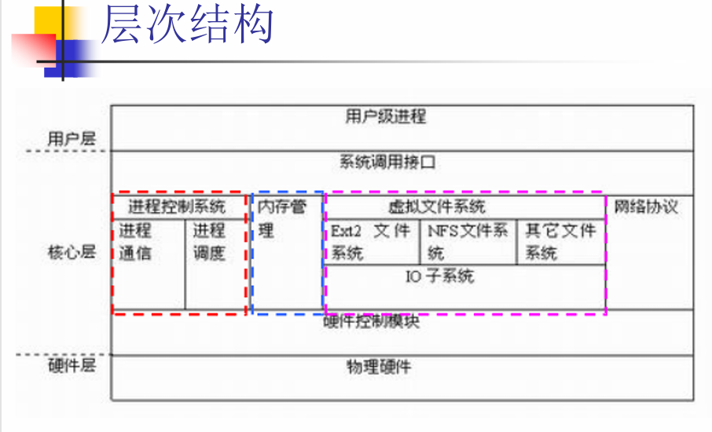
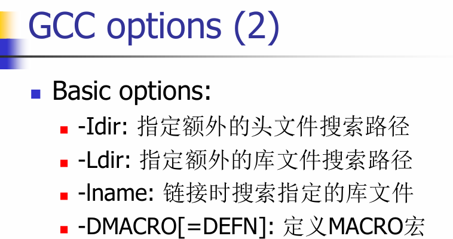


### 4.1模块依赖（标号是我自己标的）

模块 B 是一个工具箱，里面装了一把螺丝刀（符号）。模块 A 想要组装一台机器，需要借用模块 B 里的这把螺丝刀。

因为模块 A 自己没有螺丝刀，必须用 B 的。所以，在模块 A 开始工作（装载）之前，模块 B 必须已经送到现场（先装载）。如果 B 没到，A 就找不到螺丝刀（无法链接），A 就会罢工（报错）。

现实中模块就是为了完成某个功能而封装在一起的代码

* 自动按需加载
  插U盘时，自动把对应的“U盘驱动模块”加载到内核


  很显然这种做法节省内存
* 自动按需卸载
  与“自动按需加载”对应，不需要就扔掉，及时释放内存。

* 几个命令
  * moddep（Module Dependency）
    并没有这个命令，不知道PPT为什么要列，倒是有depmod，用来刷新模块之间的关系
    
  * **lsmod（List Module）**
    列出系统已经加载了哪些模块

    等价原理：系统里所有正在运行的模块信息，其实都实时记录在 Linux 的一个虚拟文件 /proc/modules 里。你输入 lsmod，实际上就是系统帮你把这个文件里的密密麻麻的数据排版成好看的表格展示出来。所以它和 cat /proc/modules 看到的内容是一样的。
  * **modinfo+模块名**
    看模块信息，后面跟文件名。查看当前正挂着哪些模块（比如：显卡驱动、声卡驱动、网络协议模块等），以及它们各自占了多大内存。
  * **insmod [module parameters]**（字面意思，insert）
    缺点：不懂依赖关系。如果模块 A 依赖模块 B，你直接 insmod A，它会直接报错“找不到符号”而失败。你必须自己手动先 insmod B，再 insmod A。

    注意：因为这涉及修改系统核心（内核），所以只有超级用户（root，或者用 sudo）才有权限执行。
  * **rmmod**（字面意思，remove）
    如果这个模块正被系统中的其他程序或者其他模块使用（被依赖），系统会拒绝卸载，并报错提示它很忙，防止系统直接崩溃。同样需要超级用户权限。
  * **modprobe [-r]**
    正常用法（加载）：modprobe 模块名。它发现你要装 A，而 A 依赖 B，它会自动帮你把 B 先装上，再把 A 装上。你只需要发一个命令，剩下的它全包了。

    带参数 -r（卸载）：modprobe -r 模块名。相当于智能版的 rmmod。它不仅会卸载你指定的模块，如果发现它依赖的底层模块现在也没人用了，它会顺便把那些没用的底层模块一起干净地卸载掉
### 4.2Linux内核模块和应用程序的区别
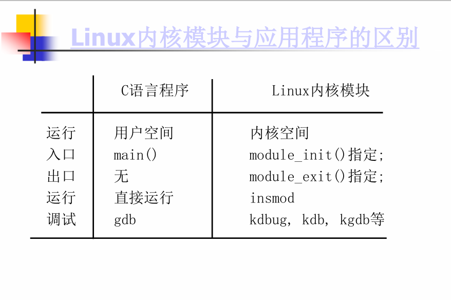

我们可以将C语言程序简单的理解成用户空间，不能直接操控底层硬件。

相对应的，linux内核模块有最高权限

均在os学过，简单说一下

* 出入口：
  内核模块没有 main() 函数。它是通过一个叫 module_init() 的宏，来指定/注册一个初始化函数。当模块被加载时，系统会调用这个被指定的函数（比如你写了个 my_driver_init()，然后通过 module_init(my_driver_init) 告诉系统这是入口）

    相对应的，linux内核还需要有module_exit(),想要卸载资源时调用（如果没有，模块会一直在内核）；c语言则不需要
* 运行
  c语言直接运行，```./a.out```

  因为内核模块编译完是```.ko```(kernel object文件)
    Linux需要用```inmod``` 或者 ```modprobe``` (还记得这两者的区别吗？)。
* 调试方法亦有不同，详见上图

***<font color="red">注意：不能用C库开发驱动</font>***

简单叙述，推荐软院同学选修毛云龙老师的os的设计和实现

C 语言标准库（比如 glibc）是运行在用户空间的。它的底层是通过系统调用（System Call）向内核索要资源。你现在自己就在内核里，相当于你已经是“底层”了，根本没办法向自己发起系统调用。

所以内核自己实现了一套专m门的函数。

打印调试信息不能用 printf()，得用内核提供的 printk()。

动态分配内存？不能用 malloc()，得用内核提供的 kmalloc()......

***<font color="red">没有内存保护机制</font>***

普通程序（用户空间）犯错时，操作系统会用 MMU（内存管理单元）和虚拟内存把它拦住，直接报一个 Segmentation fault 结束掉该进程，不会影响系统。

但是在内核空间会导致 Kernel Panic等严重问题

***<font color="red">小内核栈</font>***

内核分给每个进程/线程在内核态下的“栈内存”（Stack）非常非常小

平时我们在写 C 程序，一个线程的栈空间通常有 8MB（可以放心地在函数里声明一个 char buf[4096] 甚至更大的数组）。
但在 Linux 内核中，整个内核栈通常只有 8KB 到 16KB（因 CPU 架构而异）。这几KB需要包含所有嵌套函数的局部变量、函数调用参数、返回地址

所以不能在函数里定义巨大的局部变量（比如 int arr[2048]; 会直接导致内核栈溢出，系统崩溃）。

不能深层递归，函数嵌套调用层数太多也会把栈顶破。

需要大内存时，必须用 ```kmalloc() ```去申请堆内存。

***<font color="red">并发的考虑</font>***

Mutex Spinlock Atomic等os课上常谈的内容


### 4.3内核模块例子
```cpp
#include <linux/init.h>    // 包含了 __init 和 __exit 宏
#include <linux/module.h>  // 包含了所有内核模块都需要的基础核心定义
#include <linux/kernel.h>  // 包含了 printk 以及 KERN_INFO 级别的定义

static int __init hello_init(void)
{
    // KERN_INFO 是内核日志级别（代表普通信息）
    // printk 的输出不会直接显示在普通终端，需要通过 dmesg 命令查看
    printk(KERN_INFO "Hello world\n");
    
    return 0; // 返回 0 代表加载成功
}

static void __exit hello_exit(void)
{
    // 当运行 rmmod 卸载模块时，会触发这行打印
    printk(KERN_INFO "Goodbye world\n");
}

// 核心宏注册：告诉内核，把 hello_init 函数绑定为本模块的“装载回调入口”
module_init(hello_init);

// 核心宏注册：告诉内核，把 hello_exit 函数绑定为本模块的“卸载清理出口”
module_exit(hello_exit);
 ```
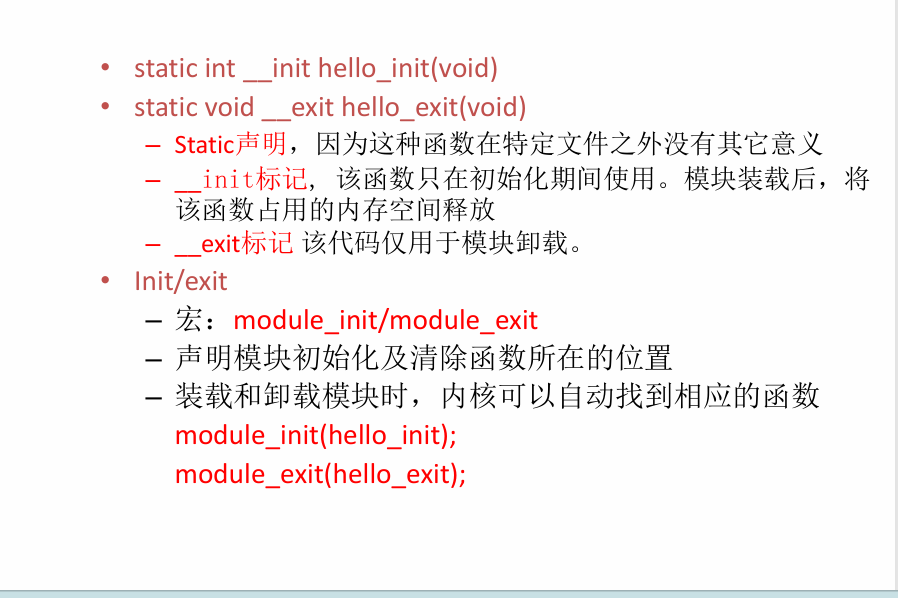
### 4.4编译内核模块
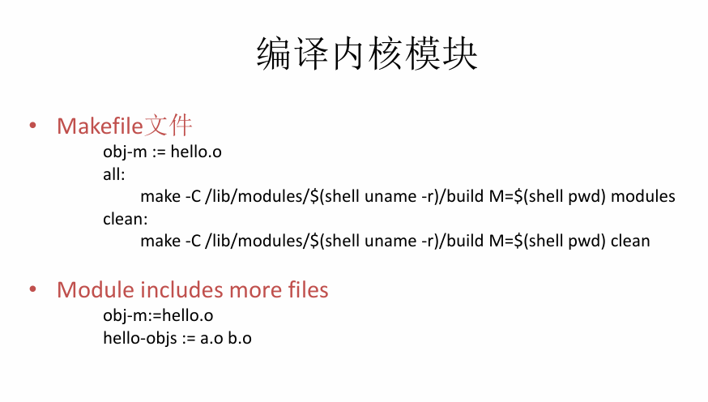
```obj-m := hello.o```

编译一个动态加载的内核模块（Module）```hello.o```

内核编译系统就会自动在当前目录下寻找 ```hello.c```，并准备把它编译成 ```hello.ko```


```obj-m := hello.o```：告诉系统，最终的目标是生成一个叫``` hello.ko``` 的内核模块。

```all```:大家约定俗成地把第一个目标写成 ```all```:，意思就是：“只要用户直接敲 make，就默认执行 ```all```: 后面定义的那一长串编译命令。

```-C```:Change Directory

```$(shell ...)```：这是 Makefile 的语法，表示在底层终端执行一个 Shell 命令。

```uname -r```：一个 Linux 命令，用来查看当前正在运行的内核版本号（比如打印出 6.1.0-21-amd64

```M=：```这是内核官方 Makefile 规定死的一个专用变量

```$(shell pwd)：```执行 ```pwd``` 命令，获取你当前编写驱动代码的绝对路径。

```hello-objs := a.o b.o```,
使用 ```[模块名]-objs```,把 ```a.c``` 编译成 ```a.o```，把 ```b.c``` 编译成 ```b.o```, 最终链接成```hello.ko```

### 4.5和硬件打交道

too much, give up.
### 4.6模块参数传递

简单来说，平时我们运行普通的 C 语言程序，可以通过 ```main(int argc, char *argv[])``` 来接收命令行参数（比如 ```./my_program 2```）。但是内核模块没有 ```main``` 函数，如果你想在加载它的时候传个数字进去改变它的行为，就必须使用 ```Linux``` 专门提供的 ```module_param``` 机制。

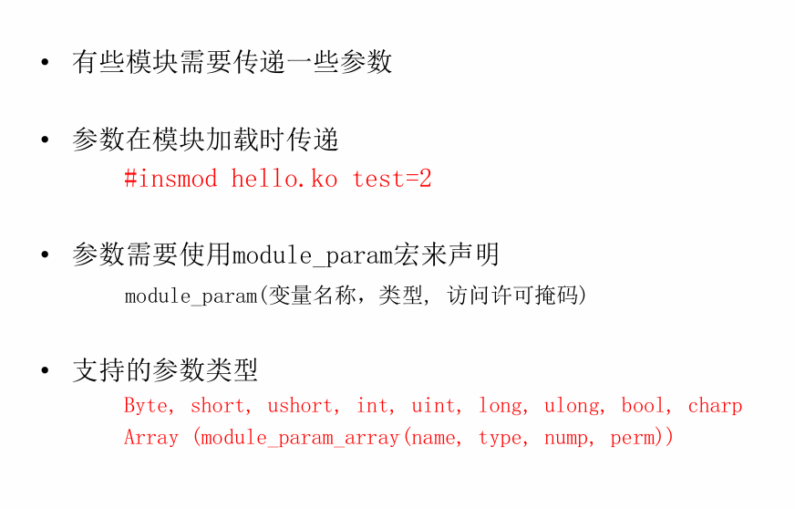
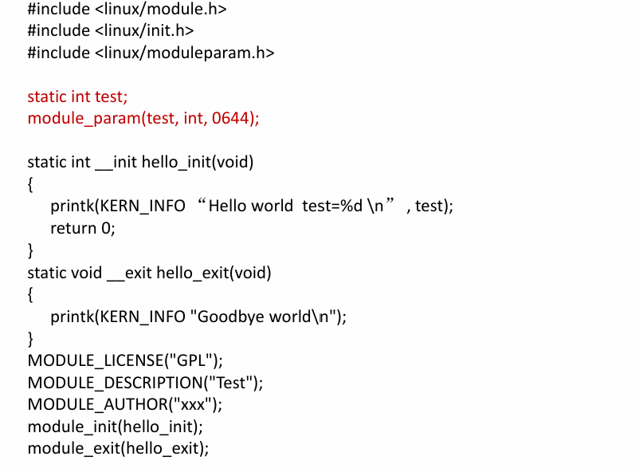
### 4.7模块间通讯实例
> 这正好对应了我们最开始讨论的底层概念：“模块 A 引用模块 B 导出的符号（函数），从而产生模块依赖”。
>

```add_sub```被```test```引用

***add_sub代码***
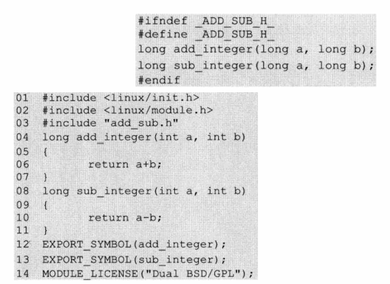


如果想把一个模块的函数开放给别的驱动用，就必须在代码最后加上 ```EXPORT_SYMBOL(函数名);```。这就相当于把这两个函数公开“导出”到了内核全局符号表中，允许别人引用。

***test模块***
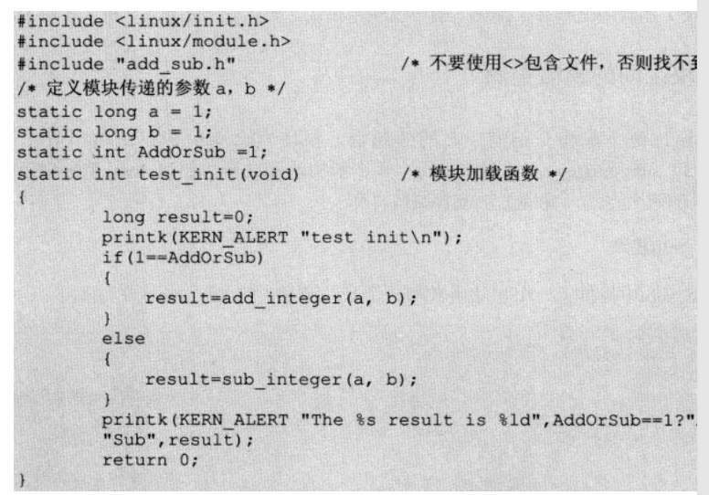
这个模块在它的初始化函数 ```test_init``` 中，调用了 add_sub 模块导出的数学函数。

包含头文件（第03行）：使用了 ```#include "add_sub.h"```。

注意：“不要使用 ```< > ```包含文件，否则找不到”。因为 ```< > ```会让编译器去系统标准库路径找，而这只是本地的一个自定义头文件，必须用双引号 ```" "```。

调用过程：根据变量 ```AddOrSub``` 的值，选择调用 ```add_integer(a, b)``` 或 ```sub_integer(a, b)```。

模块依赖的形成：由于``` test``` 模块的代码里写了 ```add_integer```，当它被加载时，内核必须先保证 ```add_sub``` 模块已经在内核中了。否则 ```test``` 模块就会因为找不到这个符号而装载失败。

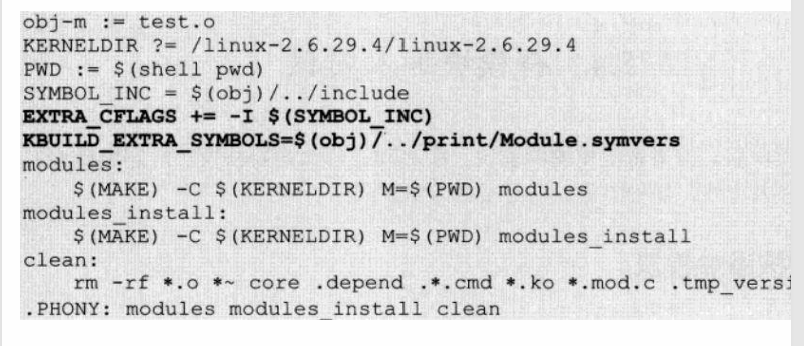
***Makefile***

```EXTRA_CFLAGS += -I ...```

```KBUILD_EXTRA_SYMBOLS = ... /Module.symvers```

当模块 A 引用模块 B 的函数时，在编译阶段，编译器需要知道被引用函数的签名和 CRC 校验码（以防止内核版本不匹配）。

模块 B (add_sub) 在编译完后，会吐出一个叫 Module.symvers 的文件（符号版本清单）。

模块 A (test) 的 Makefile 必须通过 KBUILD_EXTRA_SYMBOLS 指向模块 B 的这个清单文件，否则在编译 test 时，编译器会报警告或错误，提示找不到 add_integer 的符号版本。

作用：告诉内核编译系统，除了当前目录，还要去哪里找头文件（```-I``` 代表 ```Include``` 路径）。

### 4.8导出符号表
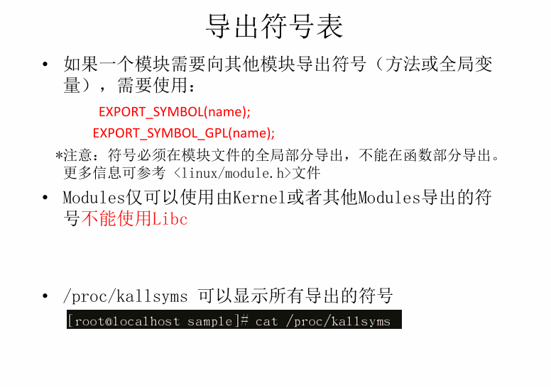

```EXPORT_SYMBOL``` 两个版本的区别

内核提供了两个宏来导出符号，它们的区别在于对开源协议（GPL）的严格程度：

```EXPORT_SYMBOL(name);```：

>***了解即可，不重要***：任何模块都可以调用这个导出的符号。不管你写的驱动是开源的（GPL 协议），还是闭源的商业私有驱动（Proprietary），都可以直接用它。

```EXPORT_SYMBOL_GPL(name);```：

>***了解即可，不重要***：只有显式声明了符合 GPL 开源协议的模块（即代码里写了 MODULE_LICENSE("GPL");），才能调用这个函数。如果你写的是闭源的商业驱动，强行调用它，系统在装载时会严厉报错，拒绝加载。


### 4.9内核模块操作和/proc文件
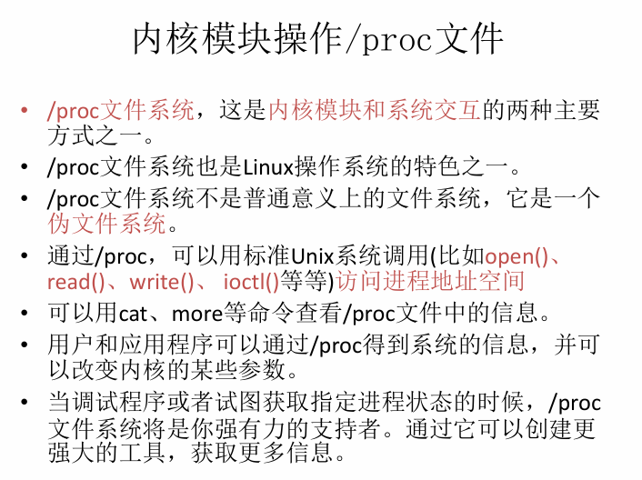
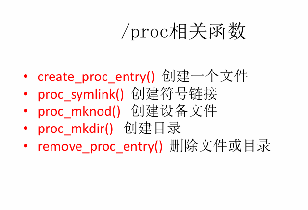

```cpp
#include <linux/init.h>
#include <linux/module.h>
#include <linux/kernel.h>
#include <linux/proc_fs.h>  // 操作 /proc 必须包含的头文件

// 1. 内存层面：在内核的全局数据区（堆栈之外）静态分配一块缓冲区
static char my_buf[1024] = "Initial Data\n"; 

// 2. 参数层面：定义一个指针，用来指向内核为我们创建的 /proc 节点结构体
static struct proc_dir_entry *my_entry;

/**
 * 3. 参数与回调层面：这是核心的“读函数”。
 * 当用户在应用层执行 "cat /proc/hello_proc" 时，内核会自动调用这个函数。
 * 它的参数不是我们传的，而是内核现场传给我们的：
 * - page: 内核提供的一个临时内存页面（大小通常是 4KB），我们必须把要展示给用户的数据拷贝到这里。
 * - start, off, count, eof, data: 内核用来控制读取位置（偏移量）和状态的参数。
 */
static int my_read_func(char *page, char **start, off_t off, int count, int *eof, void *data)
{
    int len;
    
    // 如果有偏移量，说明读完了，直接返回 0 结束，防止 cat 陷入死循环
    if (off > 0) {
        *eof = 1;
        return 0;
    }

    // 现场翻译：把我们内核全局变量 my_buf 里的内容，格式化拷贝到内核给的 page 内存页里
    len = sprintf(page, "Kernel current data: %s", my_buf);
    
    return len; // 返回写入 page 的字节数，内核会把这些字节丢给应用层的 cat
}

static int __init my_proc_init(void)
{
    /**
     * 4. 核心函数参数详解：create_proc_entry(name, mode, parent)
     * - 参数 1 ("hello_proc"): 字符串，虚拟文件名。
     * - 参数 2 (0644): 八进制数字，文件访问权限。
     * - 参数 3 (NULL): 父目录。如果是 NULL，代表直接创建在 /proc 根目录下。
     * * 内存分配发生在这里：
     * 执行这一行时，内核会在内核堆内存中，动态分配（kmalloc）一块空间，
     * 用来存放一个叫 `struct proc_dir_entry` 的结构体，用来代表这个文件，并把指针返回给 my_entry。
     */
    my_entry = create_proc_entry("hello_proc", 0644, NULL);
    
    if (my_entry == NULL) {
        return -ENOMEM; // 内存不足，创建失败
    }

    // 5. 挂接回调指针：告诉内核，以后谁来读这个文件，就用 my_read_func 函数来处理
    my_entry->read_proc = my_read_func;
    
    printk(KERN_INFO "proc module loaded successfully!\n");
    return 0;
}

static void __exit my_proc_exit(void)
{
    // 6. 内存释放：注销 /proc/hello_proc
    // 内核会把当初为 my_entry 动态分配的 struct proc_dir_entry 结构体内存完全释放（kfree）
    remove_proc_entry("hello_proc", NULL);
    printk(KERN_INFO "proc module unloaded!\n");
}

module_init(my_proc_init);
module_exit(my_proc_exit);
MODULE_LICENSE("GPL");
```
### 4.10驱动类型


#### 4.10.1字符设备驱动
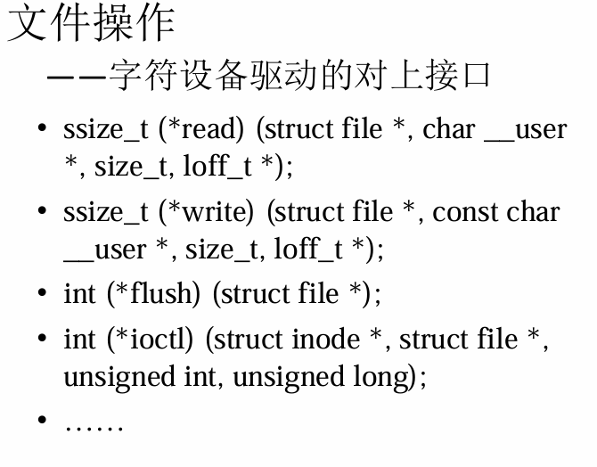

>对上接口：“上”指的是谁？：指的是用户空间（User Space）的应用层程序（比如你写的一个普通 C 语言 main 函数程序）。

* 读数据：应用层调用 ```read(fd,buffer,100);``` 时触发，
```cpp
ssize_t (*read) (struct file *filp, char __user *buf, size_t count, loff_t *f_pos);
```

```struct file *filp```,每当应用层程序用 ```open()``` 打开一个文件时，内核就会在堆内存里动态创建一个 ```struct file``` 结构体

```char __user *buf```buf 里面存的地址属于用户空间虚拟地址,绝对不要写
```*buf = 0x55;``` 或者 ```memcpy(buf, kernel_data, count);```

```cpp
ssize_t my_read(struct file *filp, char __user *buf, size_t count, loff_t *f_pos)
{
    char k_buf[32] = "Data from HW!"; // 内核空间的干净数据
    int ret;

    // 参数：目的地址(用户态), 源地址(内核态), 拷贝字节数
    ret = copy_to_user(buf, k_buf, sizeof(k_buf));
    if (ret != 0) {
        return -EFAULT; // 如果没拷成功（比如地址非法），返回错误码，安全退出！
    }

    return sizeof(k_buf); // 成功拷贝，告诉应用层读到了多少字节
}
```

```size_t count```,最多接受``count`` 字节的数据

```loff_t *f_pos```
它是一个指向 64位长整型（long long） 变量的指针。它记录了当前文件已经读到了第几个字节。

因为你每次读完数据，文件的读取位置都会往后挪。为了让下次 read 知道该接着从哪里读，你必须在 read 函数结束前，手动修改这个指针指向的内容，把进度汇报给内核

* 写数据
  ```cpp
  ssize_t (*write) (struct file *filp, const char __user *buf, size_t count, loff_t *f_pos);
  ```

  当应用层调用 write(fd, send_data, 50); 试图往驱动里写数据（比如发一个数据包，或者写入控制命令）时触发。
  ```const char __user *buf```：应用层要写入的数据源头地址

* 刷新
  ```cpp
  int (*flush) (struct file *filp);
  ```
  当应用层关闭这个设备文件（调用 ```close(fd)```）时，在文件引用计数减少之前，内核会首先触发 ```flush```
* 输入输出控制
  ```cpp
  int (*ioctl) (struct inode *inode, struct file *filp, unsigned int cmd, unsigned long arg);
  ```
  当应用层调用 ioctl(fd, CMD_LED_ON, arg); 时触发


***前面相当于定义好了我们自己的字符操作，之后需要做一下连线，即将我们实现的函数绑定到```file_operation```结构体***
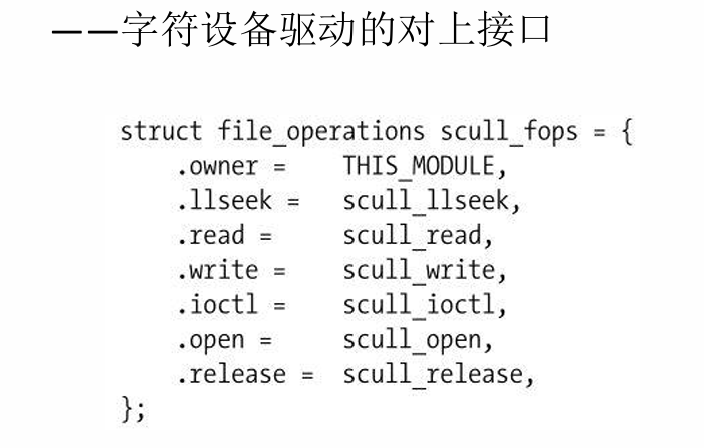

这里还需要知道几个结构
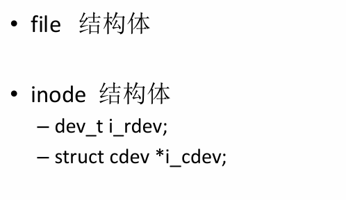

* file：
  每当应用层调用一次 ```open()```，内核就会在内存里塞进一个新的 ```struct file```
  如果三个不同的进程同时 ```open``` 了同一个设备文件，系统里就会有 3 个 ```struct file```，但它们背后指向的却是同一个 ```struct inode```

* inode:
  * ```dev_t i_rdev```
    dev_t 是一个 32 位的无符号整数。在 Linux 中，它专门用来存放设备号。
    * 主设备号（什么类型的设备）
    * 次设备号（是该类设备中的第几个）
  * ```cdev *i_cdev```
    是Linux内核中完整代表一个设备的结构体

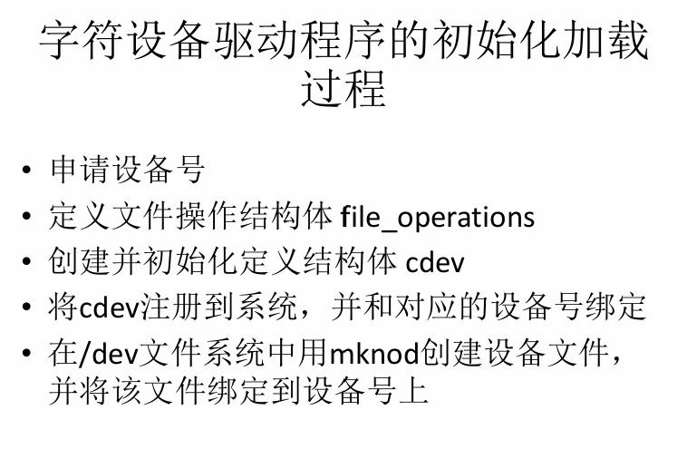

scull的例子(Gemini生成)
```cpp
#include <linux/init.h>
#include <linux/module.h>
#include <linux/kernel.h>
#include <linux/fs.h>       /* 包含申请设备号相关的 alloc_chrdev_region */
#include <linux/cdev.h>     /* 包含 cdev 结构体及操作函数 */
#include <linux/slab.h>     /* 包含内核内存分配 kmalloc/kfree */

#define SCULL_MAJOR 15      /* PPT 中定义的静态主设备号 */
#define SCULL_COUNT 1       /* 我们这次只创建一个设备文件 */

/* 1. 【对应 PPT 自定义结构】 硬件大账本结构体定义 */
struct scull_dev {
    int quantum;              /* 数据的量子大小 */
    unsigned long size;       /* 存了多少数据 */
    struct cdev cdev;         /* 【核心】字符设备本体，嵌套在最里面 */
};

/* 定义全局指针，用来指向我们的设备内存空间 */
static struct scull_dev *my_scull_device;
static dev_t scull_dev_num;  /* 用来保存内核分给我们的 32位设备号 */

/* 假装实现一个清除数据的函数（PPT 里 open 成功后如果是只写，会调用它） */
void scull_trim(struct scull_dev *dev) {
    printk(KERN_INFO "scull: Trimming device data to 0...\n");
    dev->size = 0;
}

/* 2. 【对应 PPT 实现 file_operations】 具体的 open 函数实现 */
int scull_open(struct inode *inode, struct file *filp)
{
    struct scull_dev *dev; 

    printk(KERN_INFO "scull: open method padding called!\n");

    /**
     * 【核心连线 1】通过 inode 里的 cdev 指针，
     * 反向计算出外层包裹它的大结构体 struct scull_dev 的首地址。
     */
    dev = container_of(inode->i_cdev, struct scull_dev, cdev);

    /**
     * 【核心连线 2】把找到的设备专属账本指针，挂到系统贴身的 filp->private_data 上。
     * 这样接下来的 read/write 就可以直接盲抓使用它了。
     */
    filp->private_data = dev; 

    /* 如果是以“只写”方式打开，则清空设备数据 */
    if ((filp->f_flags & O_ACCMODE) == O_WRONLY) {
        scull_trim(dev); 
    }
    
    return 0; /* 成功返回 */
}

/* 经典的 release 函数（应用层调用 close 时触发），用来做善后 */
int scull_release(struct inode *inode, struct file *filp)
{
    printk(KERN_INFO "scull: close method called!\n");
    return 0;
}

/* 3. 【对应 PPT 定义文件操作结构体】 将我们的函数绑定到标准暗号上 */
struct file_operations scull_fops = {
    .owner   = THIS_MODULE,
    .open    = scull_open,      /* 挂接我们的 open */
    .release = scull_release,   /* 挂接我们的 close */
};

/* 4. 【对应 PPT 初始化加载过程】 模块入口：现场开工 */
static int __init scull_init(void)
{
    int result;

    printk(KERN_INFO "scull: Module initializing...\n");

    /* 步骤 A：【对应 PPT 申请设备号】 动态分配设备号 */
    // 参数：用来接收结果的dev_t指针，起始次设备号，个数，驱动名字
    result = alloc_chrdev_region(&scull_dev_num, 0, SCULL_COUNT, "scull_device");
    if (result < 0) {
        printk(KERN_WARNING "scull: can't get major number\n");
        return result;
    }

    /* 步骤 B：在内核堆内存中，动态为我们的大账本结构体分配空间 */
    my_scull_device = kmalloc(sizeof(struct scull_dev), GFP_KERNEL);
    if (!my_scull_device) {
        result = -ENOMEM;
        goto fail_malloc;
    }
    memset(my_scull_device, 0, sizeof(struct scull_dev)); // 清零初始化

    /* 步骤 C：初始化大账本里的其他普通硬件参数 */
    my_scull_device->quantum = 4000;
    my_scull_device->size = 128;

    /* 步骤 D：【对应 PPT cdev结构体的初始化】 */
    // 将 cdev 本体与我们的文件操作暗号表 (scull_fops) 进行绑定
    cdev_init(&my_scull_device->cdev, &scull_fops);
    my_scull_device->cdev.owner = THIS_MODULE;

    /* 步骤 E：【对应 PPT 将 cdev 注册到系统】 */
    // 正式把 cdev 塞进内核全局哈希表，并和刚才申请到的设备号绑定在一起
    result = cdev_add(&my_scull_device->cdev, scull_dev_num, SCULL_COUNT);
    if (result) {
        printk(KERN_NOTICE "Error %d adding scull", result);
        goto fail_cdev_add;
    }

    printk(KERN_INFO "scull: Registered successfully! Major = %d, Minor = %d\n", 
           MAJOR(scull_dev_num), MINOR(scull_dev_num));
    return 0;

/* 严谨的错误处理：如果后面步骤失败，必须把前面申请的内存和设备号原路释放 */
fail_cdev_add:
    kfree(my_scull_device);
fail_malloc:
    unregister_chrdev_region(scull_dev_num, SCULL_COUNT);
    return result;
}

/* 5. 模块出口：安全撤离，清理退场 */
static void __exit scull_exit(void)
{
    printk(KERN_INFO "scull: Module exiting, cleanup underway...\n");

    if (my_scull_device) {
        /* 从内核中把字符设备注销掉，防止用户再次访问崩溃 */
        cdev_del(&my_scull_device->cdev);
        /* 释放 kmalloc 申请的大账本堆内存 */
        kfree(my_scull_device);
    }

    /* 【对应 PPT 释放设备号】 把设备号还给内核大管家 */
    unregister_chrdev_region(scull_dev_num, SCULL_COUNT);

    printk(KERN_INFO "scull: Cleanup finished. Goodbye!\n");
}

module_init(scull_init);
module_exit(scull_exit);

MODULE_LICENSE("Dual BSD/GPL"); /* 【对应 PPT 符号导出页】 必须声明开源协议 */
MODULE_AUTHOR("Lu Xu");
MODULE_DESCRIPTION("A classic LDD3 scull character driver tutorial");
```
>我们不妨先把整个过程顺一下：
mknod 时：你把 15 这个数字（主设备号）强行写进了 /dev/scull0 的文件属性里（也就是存进了 inode->i_rdev）。
用户 open 时：内核大管家去读 /dev/scull0 的 inode，翻开账本看到 i_rdev 是 15。大管家惊呼：“原来是 15 号驱动啊，也就是 scull 驱动，我把它对应的 cdev 指针挂到 inode->i_cdev 上吧！”
进入 scull_open 后：因为大管家已经帮你把 inode->i_cdev 连好了线，所以你的代码只需要用 container_of 去抓 inode->i_cdev 就能拿到设备指针了。这就是为什么在 scull_open 里面没有直接出现 i_rdev 的原因——因为大管家在调用这个函数之前，已经替你消费过 i_rdev 并帮你把线连好了


#### 4.10.2块设备

#### 4.10.3网络接口设备


