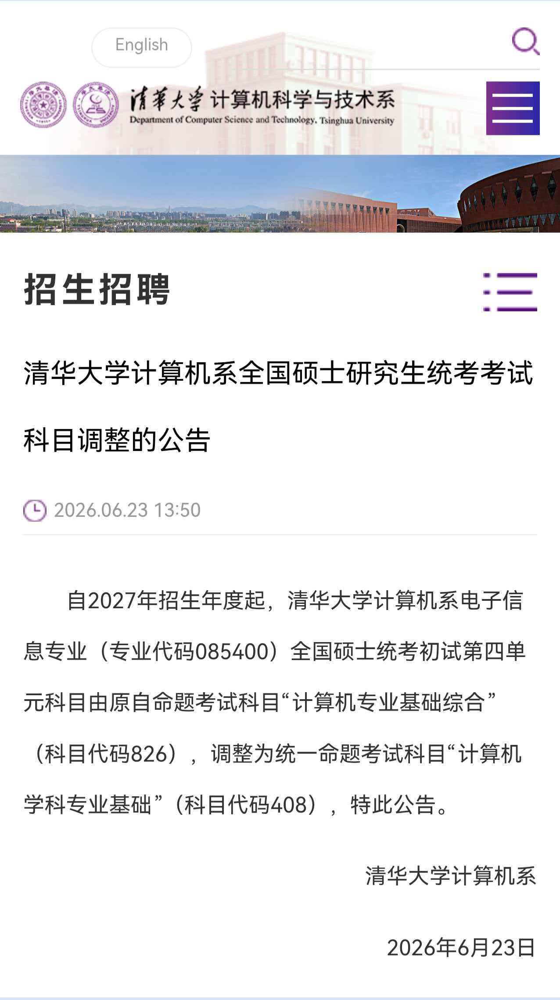

>昨天晚上得到消息，THUCS正式改考408，宣告了我三个月的专业课复习算是泡汤了，现重新制定计划

### 整体时间线

### 强化过完的DDL 10.15

### 第一阶段（DDL 8.7）
#### 数学一轮 DDL 7.15
张宇基础30讲和1000题基础题要结束，bonus是1000题刷完
#### 408一轮 DDL 8.1
王道书刷完，基本知识点弄清楚

##### 6.26-7.3 数据结构一天一章(doing)
#### 8.7-8.15 总结

#### 时间
***7:00-7:50***
***8:10-11:30***
***13:00-17:30***
***18:30-23:00***
（未完待续）

  

