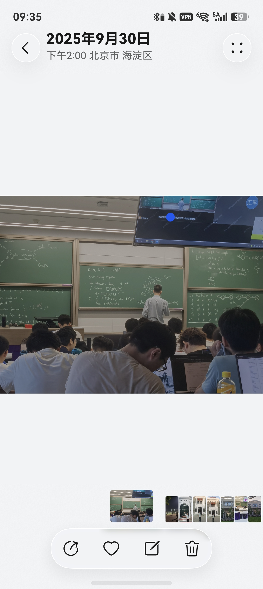
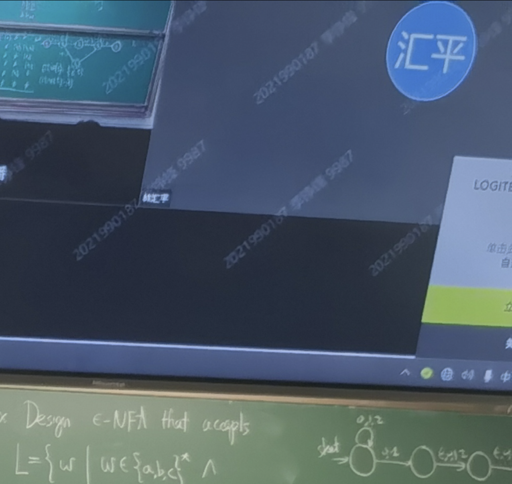

#### Lucks

最近在刷[林汇平](https://blog.lhp-pku.top/)的博客，读到 **“我不禁要问：我心目中的量子英雄是不是应当是季铮锋？”** 这句话时（估计不是，这应该是调侃导师的玩笑话）时我顿住了————想起来去年国庆前去清华玩：当时还未放假，出于好奇，我托清华同学G帮我查一下有没有计算机系有意思的课，当时想去上一下邓俊辉老师的DSA，可惜时间对不上。就在其他课程里面选了季铮锋老师的形式语言与自动机旁听，正好在南大也在上这门课。
  
于是我拿起手机翻看当时课上拍的照片（因为季老师的板书极其工整，我就拍下来留个纪念）。我看了看照片上的黑板，应该在证DFA，NFA的等价，目光向上扫到了屏幕上的腾讯会议，右上方参会者的名字是“汇平”。
  
  
我知道这是一个小小的巧合罢了，但是我还是感到惊奇————时空交织，自己留下的印记竟成了闭环。

我开始回忆起来，好像这件事情的开始要追溯到更早之前————
  

我是在b站上偶然看到汇平学姐在分享专业相关的东西，视频是北大前沿计算中心发的。我是在大一关注这个账号的，当时只是好奇在b站上看看有没有top2 cs相关学院开的号，想着或许视频内容会对我有些启发。但是之后这个号在一直躺在关注列表了，主要原因是大多数学术分享我几乎不懂，有些连英文名都认不出来。但是这个原因（我认识AI，认识Quantum这个词）我点开了汇平学姐的视频。听了一会儿，我认识到这是一位为数不多能把抽象概念讲清晰的人，同时也好奇一个北大的本科生为什么去清华读博，于是在浏览器里搜到了她的博客，才有了之后的巧合。

从莫名其妙地关注一个账号到搜到博客，发现之前的照片，三年的时间像是沿着环路流淌，而身在其中的我在最后一刻才看明白，仿佛闭着眼过独木桥，每一步都踏在了正确的地方。

这是运气吗？我一直知道我是个运气不错的人，三年前的这个时候，我查到了高三最高的一次分数————当时的我的估分660分封顶，结果却高出了17分，我和父母都很开心。之后我回到自己房间瘫在床上，感受突然变得强烈，但不是因为欣喜若狂，而是一种劫后余生的庆幸反噬。我在一帧一帧倒放我的一切，每个重要的时刻、关键的选择被单独切出————从高处上俯瞰走过的每一个岔路，自己都莫名其妙地选对正确的方向。虽然我一直期望自己是被运气加持的，可真是到了好事都来临的时候自己又恍惚了：这真的是偶然吗？是否我生活在一个存在造物主的世界呢？作为一个接受过教育、学过自然科学的人，我或许不该有这种荒谬的想法，但是又想到杨振宁对造物主的一些看法（大意是，他认为是存在的，但不是说像宗教里面所说的拟人化的神明，而是说可能存在这么一个东西对我们现在的发现有所影响，因为他觉得自然界中有太多的巧合，包括他研究的理论物理），又想到自己的很多误打误撞、歪打正着，或许真的存在这样一种神秘的力量？

我从未明白这个问题（当然也不可能想明白，这是个深奥的哲学问题，而我如此浅薄），只是从那时开始觉得自己是个非常幸运的人。偶然和别人谈起高考时，我也总是强调运气的成分。现在回想起来，高考对我最大的影响莫过于让我一直有一个积极的心理暗示————我是幸运的人。现在回想起来，这种潜意识一直在帮助我————特别是当遇到挫折时，仿佛总是有一个声音告诉我：你是个幸运的人，再坚持一下。当然，我也慢慢习惯于用运气理解我的小成就，总是能够捕捉到偶然因素不可磨灭的作用。这貌似可以说是我的得失观？但我感觉有点装过头了🤣，不如叫做好心态。

遇到Z之前，我一直把过去练就的好心态（我引以为傲的东西）归功于运气（甚至从小学时期开始，感觉这个可以单独写一个长篇叫做“My Lucks”）————是我太好运了，在种种磨难中都用正确的方式坚持了下来，让我再经历一次我肯定就成为一个萎靡不振的悲观者了。在一次偶然的聊天中，我告诉了Z我的幸运，Z想了想，说了一段话，大概意思是，可能我只是习惯于看到过去经历中美好的部分，那些付出的汗水和痛苦的记忆被忘却了，所以我才觉得自己是特别幸运的，“你是个乐观的人。”她说。

我有些忘记当时的情景了，但是这确实引发了我很长时间的思考。我开始想，是否是因为我本身比较乐观，所以出现了回忆的盲区，只看到了幸运的事，而不是我一直以为的————我从过往幸运的经验中才变得乐观。🤔我现在也没想明白这个“鸡与蛋”的问题，但我知道现在他们之间一直在正向循环————乐观让我能够捕捉到幸运的事，而这形成了我的回忆（Maybe是美化过的），这种回忆里幸运的经验让我更加积极。

按照Z的观点，我本身是具有了一些属性，这些属性让之后的事变得巧合，而我只是误以为这是lucky。这样来推理的话，我发现汇平学姐的博客并找到巧合之处并非真的误打误撞，而是因为我对cs这个学科真的有兴趣，所以关注了一个做的比较好的账号，所以选了难但是有趣的选修课————形式语言自动机，所以去清华的时候还要旁听这门课，所以看到了汇平学姐的学术分享，所以还要继续看她的博客，所以发现巧合，这有什么稀奇的！但我不是很认可，因为这解释不了我为什么拍照，因为我不是很爱拍照片，那次也是因为上课时Z给我发微信了而已。所以直到现在我还是坚信自己是幸运的。

一件这么小的事情或许在平时不足以让我思考这么多，可能是因为最近确实遇到了麻烦————THUCS正式改考408，宣告了我三个月的专业课复习算是泡汤了。但是我还是难以改变自己的思维惯性————这或许是件好事，我可能本来就不擅长做难题😄希望这回也会有幸运在。

感谢你耐心看到这里，你肯定有很多Lucks🍀。

  
