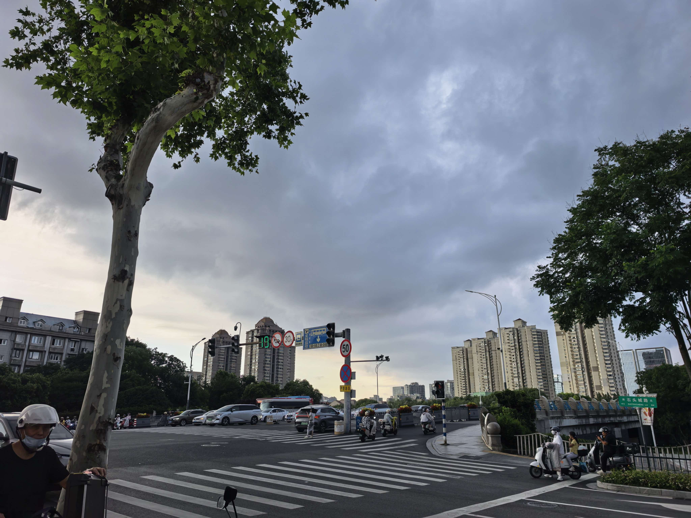
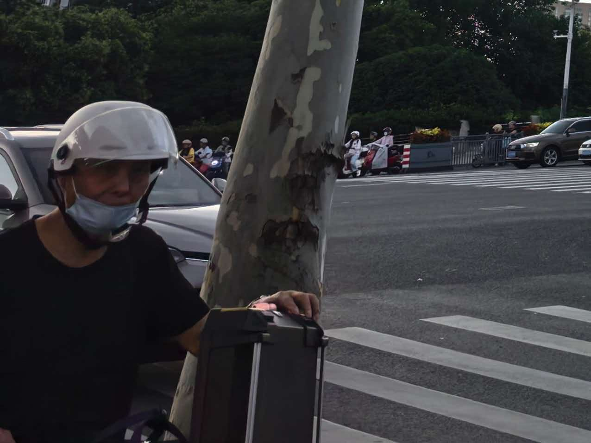

  
  
今天天气不错，我从学校北门出发，沿北京西路骑行至秦淮河，而后右转进入南艺后街。

自己沿着河走了半个小时，感觉有点饿了，随后找了一家没吃过的小店吃了一碗湖南米粉（感觉还可以，就在宜宾燃面南艺店南侧10m😋，但是没有美味值得单独为此跑一趟）。

### 正片开始🤣

我出门看见这云挺奇特的（如图）就顺手拍下来了，准备骑车走人，突然一个👴朝我吼“你pei我干什么”😡😡😡。我有点懵了，可能吃了太多米粉有点晕碳，没明白过来————我呸你？没有朝你吐痰啊（我也不会向其他任何地方随地吐痰，作为一个正在接受高等教育的学生还是有点素质的😄），是不是有什么误会。于是我莫名其妙地看着他。

然后他越来越生气，一直重复那句话，结果越生气我越听不清，然后我只能说我刚吃完饭准备走，这👴突然拿出手机（我还以为他要记录我的“违法行为”），然后我继续说我刚吃完饭，他继续说我pei他，重复了大概三遍，之后我听清了，他是问我为什么拍他。

其实这时候我应该直接骑车走的，但是我还是告诉他我没有拍他（心平气和版），结果这👴喋（b）喋（b）不（lai）休（lai），我有点不耐烦了，瞪了他一眼，结果他不说话了🤷‍♀️❓（其实当时有点怕他失去理智拿着手里的钥匙扎我，我已经做好跑路的准备了），有点好笑又有点煞风景🤣。

之后我就骑车回学校了，路上为此事闷闷了10min，属实不够优雅，在此做检讨。同时谢谢👴失去了少年意气，没有一时冲动拿着钥匙捅我，感谢不杀之恩🙏🙏

